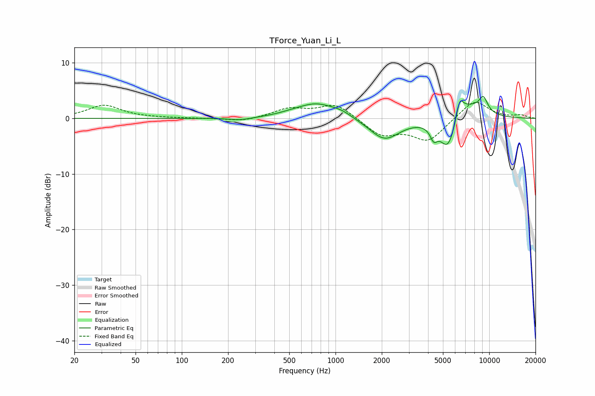

# TForce_Yuan_Li_L
See [usage instructions](https://github.com/jaakkopasanen/AutoEq#usage) for more options and info.

### Parametric EQs
Apply preamp of -4.1 dB when using parametric equalizer.

|   # | Type    |   Fc (Hz) |    Q |   Gain (dB) |
|-----|---------|-----------|------|-------------|
|   1 | Peaking |       241 | 1.87 |        -0.5 |
|   2 | Peaking |       510 | 1.79 |         0.2 |
|   3 | Peaking |       749 | 1.1  |         2.7 |
|   4 | Peaking |      1096 | 2.13 |         0.7 |
|   5 | Peaking |      2086 | 1.43 |        -3.9 |
|   6 | Peaking |      4355 | 5.99 |        -2.1 |
|   7 | Peaking |      5409 | 2.41 |        -6.7 |
|   8 | Peaking |      6425 | 5.91 |         3.3 |
|   9 | Peaking |      6951 | 1.33 |         3.5 |
|  10 | Peaking |      9151 | 4.35 |         2.7 |

### Fixed Band EQs
When using fixed band (also called graphic) equalizer, apply preamp of **-3.0 dB** (if available) and set gains manually with these parameters.

|   # | Type    |   Fc (Hz) |    Q |   Gain (dB) |
|-----|---------|-----------|------|-------------|
|   1 | Peaking |        31 | 1.41 |         2.4 |
|   2 | Peaking |        62 | 1.41 |         0   |
|   3 | Peaking |       125 | 1.41 |         0   |
|   4 | Peaking |       250 | 1.41 |        -0.6 |
|   5 | Peaking |       500 | 1.41 |         1.7 |
|   6 | Peaking |      1000 | 1.41 |         2.6 |
|   7 | Peaking |      2000 | 1.41 |        -3   |
|   8 | Peaking |      4000 | 1.41 |        -4   |
|   9 | Peaking |      8000 | 1.41 |         3.4 |
|  10 | Peaking |     16000 | 1.41 |         0.5 |

### Graphs

