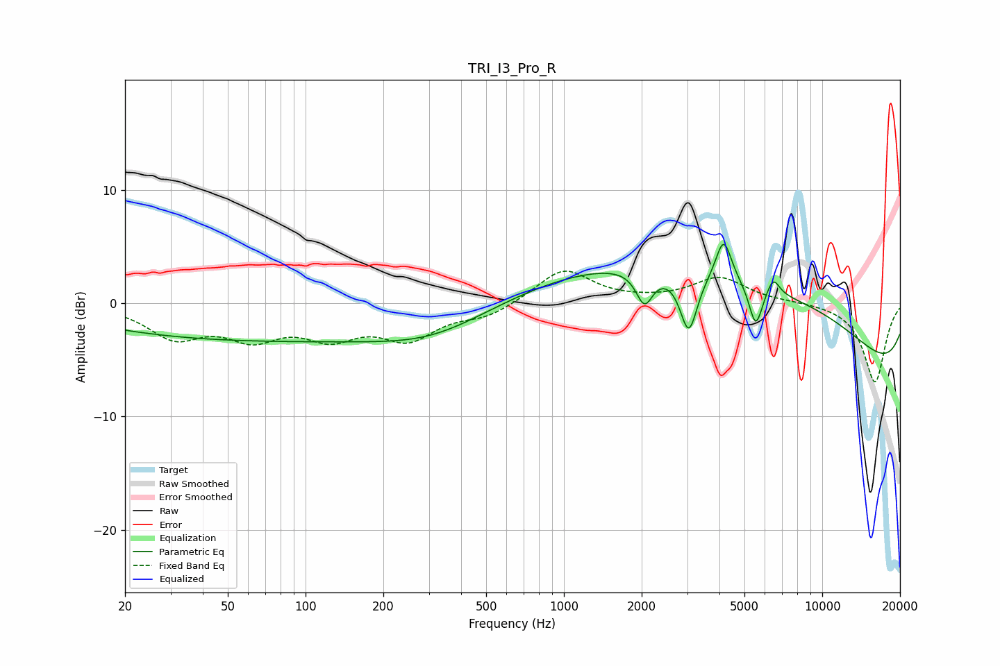

# TRI_I3_Pro_R
See [usage instructions](https://github.com/jaakkopasanen/AutoEq#usage) for more options and info.

### Parametric EQs
Apply preamp of -5.3 dB when using parametric equalizer.

|   # | Type    |   Fc (Hz) |    Q |   Gain (dB) |
|-----|---------|-----------|------|-------------|
|   1 | Peaking |        61 | 0.21 |        -3.2 |
|   2 | Peaking |       317 | 0.63 |        -2   |
|   3 | Peaking |      2051 | 4.35 |        -3   |
|   4 | Peaking |      3043 | 4.23 |        -5.3 |
|   5 | Peaking |      3290 | 0.18 |         3   |
|   6 | Peaking |      4153 | 4.59 |         3.8 |
|   7 | Peaking |      5527 | 5.38 |        -3.7 |
|   8 | Peaking |      5693 | 0.25 |         7.2 |
|   9 | Peaking |      6459 | 5.72 |         1.5 |
|  10 | Peaking |     10000 | 0.18 |        -9.3 |

### Fixed Band EQs
When using fixed band (also called graphic) equalizer, apply preamp of **-2.9 dB** (if available) and set gains manually with these parameters.

|   # | Type    |   Fc (Hz) |    Q |   Gain (dB) |
|-----|---------|-----------|------|-------------|
|   1 | Peaking |        31 | 1.41 |        -2.8 |
|   2 | Peaking |        62 | 1.41 |        -2.6 |
|   3 | Peaking |       125 | 1.41 |        -2.5 |
|   4 | Peaking |       250 | 1.41 |        -2.9 |
|   5 | Peaking |       500 | 1.41 |        -1.1 |
|   6 | Peaking |      1000 | 1.41 |         3.1 |
|   7 | Peaking |      2000 | 1.41 |         0.1 |
|   8 | Peaking |      4000 | 1.41 |         2.2 |
|   9 | Peaking |      8000 | 1.41 |         0.1 |
|  10 | Peaking |     16000 | 1.41 |        -7   |

### Graphs

