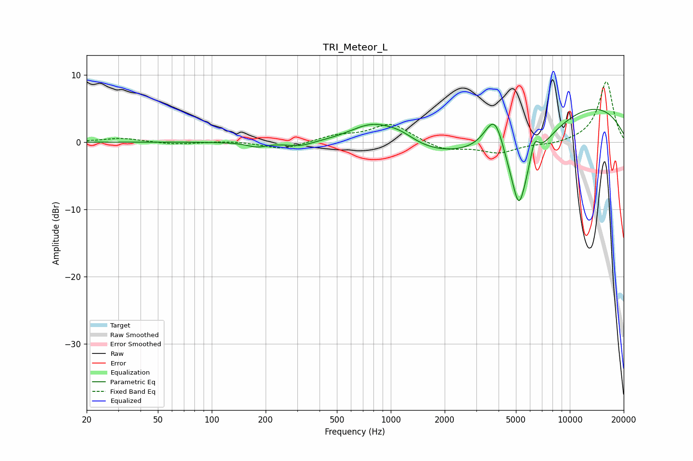

# TRI_Meteor_L
See [usage instructions](https://github.com/jaakkopasanen/AutoEq#usage) for more options and info.

### Parametric EQs
Apply preamp of -5.0 dB when using parametric equalizer.

|   # | Type    |   Fc (Hz) |    Q |   Gain (dB) |
|-----|---------|-----------|------|-------------|
|   1 | Peaking |       179 | 2.61 |        -0.7 |
|   2 | Peaking |       309 | 2.02 |        -0.7 |
|   3 | Peaking |       793 | 0.99 |         3.9 |
|   4 | Peaking |      1132 | 1.56 |         1.4 |
|   5 | Peaking |      3548 | 0.23 |        -4.8 |
|   6 | Peaking |      3828 | 2.26 |         7.5 |
|   7 | Peaking |      5193 | 1.22 |       -10.4 |
|   8 | Peaking |      5196 | 4.8  |        -4   |
|   9 | Peaking |      6336 | 5.25 |         3.7 |
|  10 | Peaking |      9086 | 0.27 |         8.5 |

### Fixed Band EQs
When using fixed band (also called graphic) equalizer, apply preamp of **-9.1 dB** (if available) and set gains manually with these parameters.

|   # | Type    |   Fc (Hz) |    Q |   Gain (dB) |
|-----|---------|-----------|------|-------------|
|   1 | Peaking |        31 | 1.41 |         0.6 |
|   2 | Peaking |        62 | 1.41 |        -0.4 |
|   3 | Peaking |       125 | 1.41 |         0.2 |
|   4 | Peaking |       250 | 1.41 |        -1.1 |
|   5 | Peaking |       500 | 1.41 |         0.9 |
|   6 | Peaking |      1000 | 1.41 |         2.8 |
|   7 | Peaking |      2000 | 1.41 |        -1.2 |
|   8 | Peaking |      4000 | 1.41 |        -1.5 |
|   9 | Peaking |      8000 | 1.41 |        -0.4 |
|  10 | Peaking |     16000 | 1.41 |         9.1 |

### Graphs

