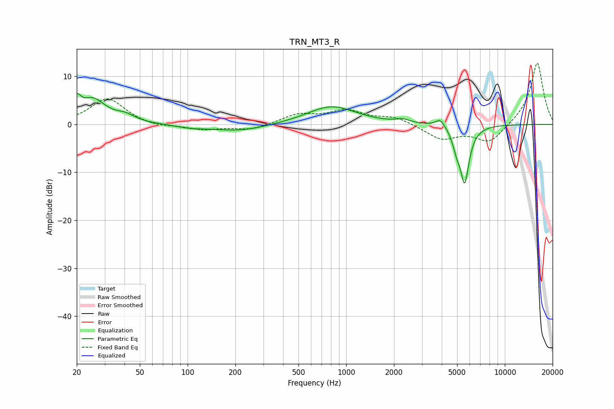

# TRN_MT3_R
See [usage instructions](https://github.com/jaakkopasanen/AutoEq#usage) for more options and info.

### Parametric EQs
Apply preamp of -6.5 dB when using parametric equalizer.

|   # | Type    |   Fc (Hz) |    Q |   Gain (dB) |
|-----|---------|-----------|------|-------------|
|   1 | Peaking |        20 | 5.97 |         3.2 |
|   2 | Peaking |        25 | 1.73 |         5   |
|   3 | Peaking |        40 | 2.34 |         1.3 |
|   4 | Peaking |       104 | 1.61 |        -0.5 |
|   5 | Peaking |       211 | 0.81 |        -1.4 |
|   6 | Peaking |       806 | 0.93 |         3.8 |
|   7 | Peaking |      2275 | 3.4  |         0.7 |
|   8 | Peaking |      3925 | 4.85 |         1.7 |
|   9 | Peaking |      4970 | 5.85 |        -2.8 |
|  10 | Peaking |      5581 | 4.86 |       -11.7 |

### Fixed Band EQs
When using fixed band (also called graphic) equalizer, apply preamp of **-12.8 dB** (if available) and set gains manually with these parameters.

|   # | Type    |   Fc (Hz) |    Q |   Gain (dB) |
|-----|---------|-----------|------|-------------|
|   1 | Peaking |        31 | 1.41 |         5.5 |
|   2 | Peaking |        62 | 1.41 |        -0.7 |
|   3 | Peaking |       125 | 1.41 |        -1.1 |
|   4 | Peaking |       250 | 1.41 |        -1.2 |
|   5 | Peaking |       500 | 1.41 |         2   |
|   6 | Peaking |      1000 | 1.41 |         2.6 |
|   7 | Peaking |      2000 | 1.41 |         1.5 |
|   8 | Peaking |      4000 | 1.41 |        -3   |
|   9 | Peaking |      8000 | 1.41 |        -3.9 |
|  10 | Peaking |     16000 | 1.41 |        13   |

### Graphs

