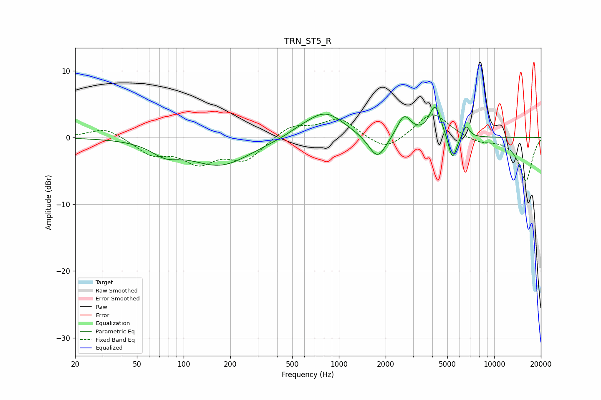

# TRN_ST5_R
See [usage instructions](https://github.com/jaakkopasanen/AutoEq#usage) for more options and info.

### Parametric EQs
Apply preamp of -4.6 dB when using parametric equalizer.

|   # | Type    |   Fc (Hz) |    Q |   Gain (dB) |
|-----|---------|-----------|------|-------------|
|   1 | Peaking |        76 | 1.59 |        -1.7 |
|   2 | Peaking |       172 | 0.72 |        -4.1 |
|   3 | Peaking |       555 | 1.69 |         0.5 |
|   4 | Peaking |       815 | 1.15 |         3.9 |
|   5 | Peaking |      1739 | 2    |        -0.5 |
|   6 | Peaking |      1776 | 2.51 |        -3.3 |
|   7 | Peaking |      2627 | 3.15 |         3.3 |
|   8 | Peaking |      4165 | 3.68 |         4.6 |
|   9 | Peaking |      5391 | 5.08 |        -3.9 |
|  10 | Peaking |      6584 | 6    |         1.8 |

### Fixed Band EQs
When using fixed band (also called graphic) equalizer, apply preamp of **-3.5 dB** (if available) and set gains manually with these parameters.

|   # | Type    |   Fc (Hz) |    Q |   Gain (dB) |
|-----|---------|-----------|------|-------------|
|   1 | Peaking |        31 | 1.41 |         1.6 |
|   2 | Peaking |        62 | 1.41 |        -2.3 |
|   3 | Peaking |       125 | 1.41 |        -3.4 |
|   4 | Peaking |       250 | 1.41 |        -3.2 |
|   5 | Peaking |       500 | 1.41 |         1.8 |
|   6 | Peaking |      1000 | 1.41 |         2.8 |
|   7 | Peaking |      2000 | 1.41 |        -2.2 |
|   8 | Peaking |      4000 | 1.41 |         3.8 |
|   9 | Peaking |      8000 | 1.41 |        -0.8 |
|  10 | Peaking |     16000 | 1.41 |        -6.5 |

### Graphs

