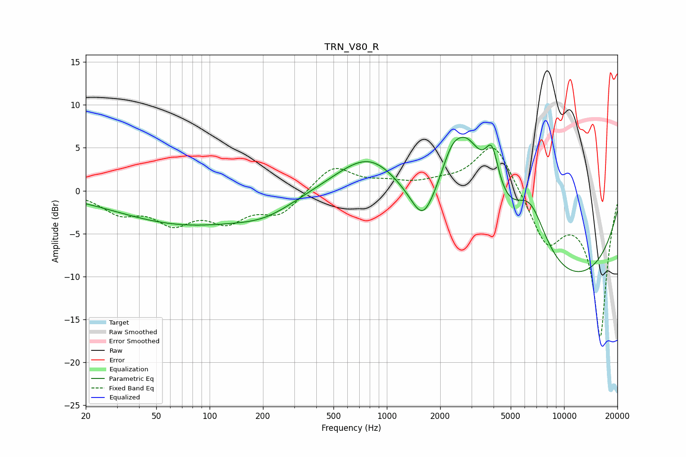

# TRN_V80_R
See [usage instructions](https://github.com/jaakkopasanen/AutoEq#usage) for more options and info.

### Parametric EQs
Apply preamp of -6.3 dB when using parametric equalizer.

|   # | Type    |   Fc (Hz) |    Q |   Gain (dB) |
|-----|---------|-----------|------|-------------|
|   1 | Peaking |        74 | 0.37 |        -4.3 |
|   2 | Peaking |        77 | 0.48 |         0.5 |
|   3 | Peaking |       208 | 0.84 |        -1.5 |
|   4 | Peaking |       823 | 0.71 |         6.4 |
|   5 | Peaking |      1595 | 2.26 |        -3.6 |
|   6 | Peaking |      2316 | 2.36 |         3.2 |
|   7 | Peaking |      2846 | 1.15 |        11.3 |
|   8 | Peaking |      3920 | 3.55 |         5.4 |
|   9 | Peaking |      6443 | 0.82 |        15.7 |
|  10 | Peaking |      6931 | 0.28 |       -20   |

### Fixed Band EQs
When using fixed band (also called graphic) equalizer, apply preamp of **-5.1 dB** (if available) and set gains manually with these parameters.

|   # | Type    |   Fc (Hz) |    Q |   Gain (dB) |
|-----|---------|-----------|------|-------------|
|   1 | Peaking |        31 | 1.41 |        -2.3 |
|   2 | Peaking |        62 | 1.41 |        -3.3 |
|   3 | Peaking |       125 | 1.41 |        -3   |
|   4 | Peaking |       250 | 1.41 |        -2.6 |
|   5 | Peaking |       500 | 1.41 |         3   |
|   6 | Peaking |      1000 | 1.41 |         0.7 |
|   7 | Peaking |      2000 | 1.41 |         0.7 |
|   8 | Peaking |      4000 | 1.41 |         5.9 |
|   9 | Peaking |      8000 | 1.41 |        -5.8 |
|  10 | Peaking |     16000 | 1.41 |       -16.9 |

### Graphs

