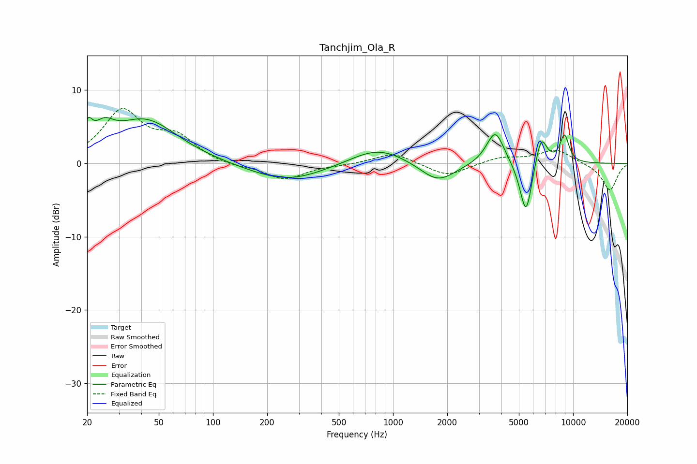

# Tanchjim_Ola_R
See [usage instructions](https://github.com/jaakkopasanen/AutoEq#usage) for more options and info.

### Parametric EQs
Apply preamp of -6.4 dB when using parametric equalizer.

|   # | Type    |   Fc (Hz) |    Q |   Gain (dB) |
|-----|---------|-----------|------|-------------|
|   1 | Peaking |        20 | 6    |         2.7 |
|   2 | Peaking |        25 | 2.55 |         2.5 |
|   3 | Peaking |        42 | 0.78 |         5.9 |
|   4 | Peaking |       258 | 0.67 |        -2.5 |
|   5 | Peaking |       823 | 0.91 |         2.4 |
|   6 | Peaking |      1773 | 1.45 |        -2.7 |
|   7 | Peaking |      3697 | 2.86 |         4.7 |
|   8 | Peaking |      5476 | 4    |        -7.6 |
|   9 | Peaking |      6640 | 4.15 |         4.3 |
|  10 | Peaking |      8959 | 5.01 |         3.7 |

### Fixed Band EQs
When using fixed band (also called graphic) equalizer, apply preamp of **-7.6 dB** (if available) and set gains manually with these parameters.

|   # | Type    |   Fc (Hz) |    Q |   Gain (dB) |
|-----|---------|-----------|------|-------------|
|   1 | Peaking |        31 | 1.41 |         6.9 |
|   2 | Peaking |        62 | 1.41 |         3.2 |
|   3 | Peaking |       125 | 1.41 |        -0.5 |
|   4 | Peaking |       250 | 1.41 |        -2.2 |
|   5 | Peaking |       500 | 1.41 |        -0.2 |
|   6 | Peaking |      1000 | 1.41 |         1.5 |
|   7 | Peaking |      2000 | 1.41 |        -1.8 |
|   8 | Peaking |      4000 | 1.41 |         0.8 |
|   9 | Peaking |      8000 | 1.41 |         1.9 |
|  10 | Peaking |     16000 | 1.41 |        -3.7 |

### Graphs

