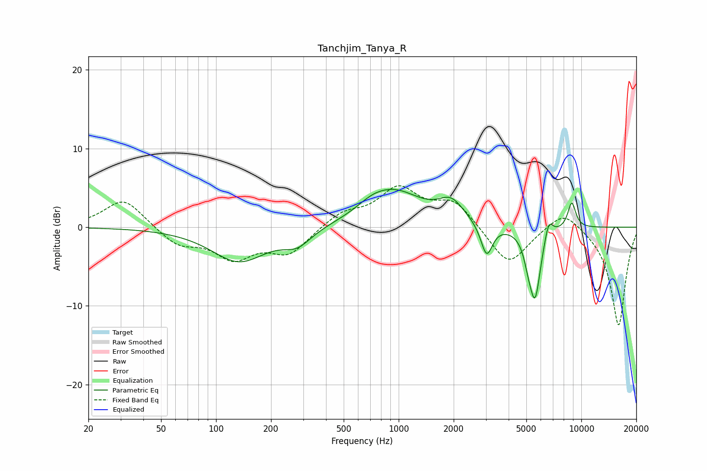

# Tanchjim_Tanya_R
See [usage instructions](https://github.com/jaakkopasanen/AutoEq#usage) for more options and info.

### Parametric EQs
Apply preamp of -4.9 dB when using parametric equalizer.

|   # | Type    |   Fc (Hz) |    Q |   Gain (dB) |
|-----|---------|-----------|------|-------------|
|   1 | Peaking |       134 | 0.93 |        -4.3 |
|   2 | Peaking |       279 | 1.86 |        -1.9 |
|   3 | Peaking |       706 | 1.9  |         0.7 |
|   4 | Peaking |       930 | 0.9  |         4.5 |
|   5 | Peaking |      1942 | 2.05 |         2.6 |
|   6 | Peaking |      3032 | 4.43 |        -4.2 |
|   7 | Peaking |      5127 | 5.99 |        -1.6 |
|   8 | Peaking |      5581 | 4.31 |        -8.8 |
|   9 | Peaking |      6626 | 5.92 |         2.4 |
|  10 | Peaking |      8866 | 5.78 |         3.3 |

### Fixed Band EQs
When using fixed band (also called graphic) equalizer, apply preamp of **-5.4 dB** (if available) and set gains manually with these parameters.

|   # | Type    |   Fc (Hz) |    Q |   Gain (dB) |
|-----|---------|-----------|------|-------------|
|   1 | Peaking |        31 | 1.41 |         3.7 |
|   2 | Peaking |        62 | 1.41 |        -2.2 |
|   3 | Peaking |       125 | 1.41 |        -3.6 |
|   4 | Peaking |       250 | 1.41 |        -3.2 |
|   5 | Peaking |       500 | 1.41 |         1.8 |
|   6 | Peaking |      1000 | 1.41 |         4.7 |
|   7 | Peaking |      2000 | 1.41 |         3.2 |
|   8 | Peaking |      4000 | 1.41 |        -5   |
|   9 | Peaking |      8000 | 1.41 |         2.6 |
|  10 | Peaking |     16000 | 1.41 |       -12.6 |

### Graphs

