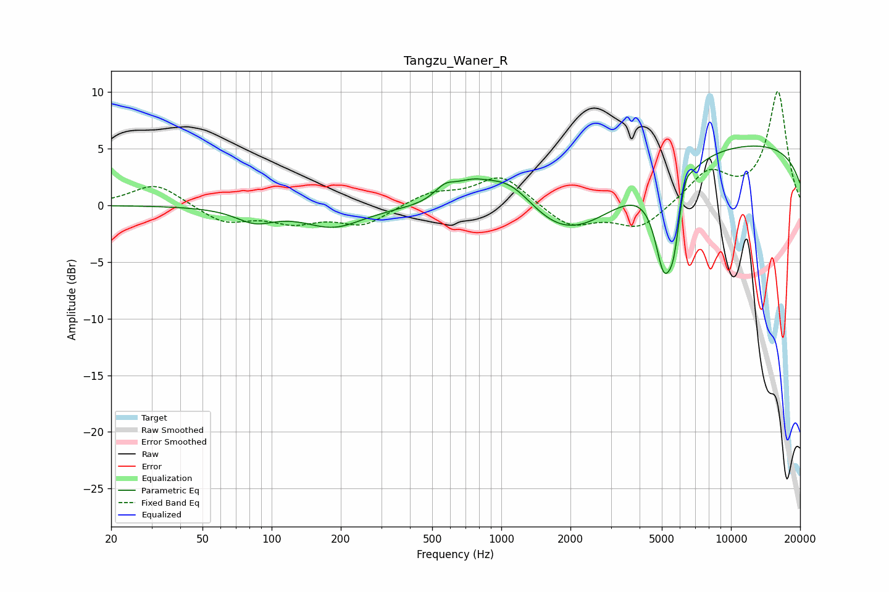

# Tangzu_Waner_R
See [usage instructions](https://github.com/jaakkopasanen/AutoEq#usage) for more options and info.

### Parametric EQs
Apply preamp of -5.3 dB when using parametric equalizer.

|   # | Type    |   Fc (Hz) |    Q |   Gain (dB) |
|-----|---------|-----------|------|-------------|
|   1 | Peaking |        85 | 1.7  |        -1.2 |
|   2 | Peaking |       186 | 1.1  |        -1.8 |
|   3 | Peaking |       567 | 3.03 |         1.1 |
|   4 | Peaking |       736 | 1.69 |         1.6 |
|   5 | Peaking |      1094 | 1.13 |         3.7 |
|   6 | Peaking |      1933 | 0.58 |        -5.5 |
|   7 | Peaking |      5101 | 3.35 |        -7.6 |
|   8 | Peaking |      5638 | 5.04 |        -3.9 |
|   9 | Peaking |      6308 | 6    |         1.4 |
|  10 | Peaking |     10000 | 0.18 |         5.6 |

### Fixed Band EQs
When using fixed band (also called graphic) equalizer, apply preamp of **-10.1 dB** (if available) and set gains manually with these parameters.

|   # | Type    |   Fc (Hz) |    Q |   Gain (dB) |
|-----|---------|-----------|------|-------------|
|   1 | Peaking |        31 | 1.41 |         2   |
|   2 | Peaking |        62 | 1.41 |        -1.5 |
|   3 | Peaking |       125 | 1.41 |        -1.3 |
|   4 | Peaking |       250 | 1.41 |        -1.7 |
|   5 | Peaking |       500 | 1.41 |         1.1 |
|   6 | Peaking |      1000 | 1.41 |         2.7 |
|   7 | Peaking |      2000 | 1.41 |        -1.9 |
|   8 | Peaking |      4000 | 1.41 |        -2.1 |
|   9 | Peaking |      8000 | 1.41 |         2.9 |
|  10 | Peaking |     16000 | 1.41 |        10   |

### Graphs

