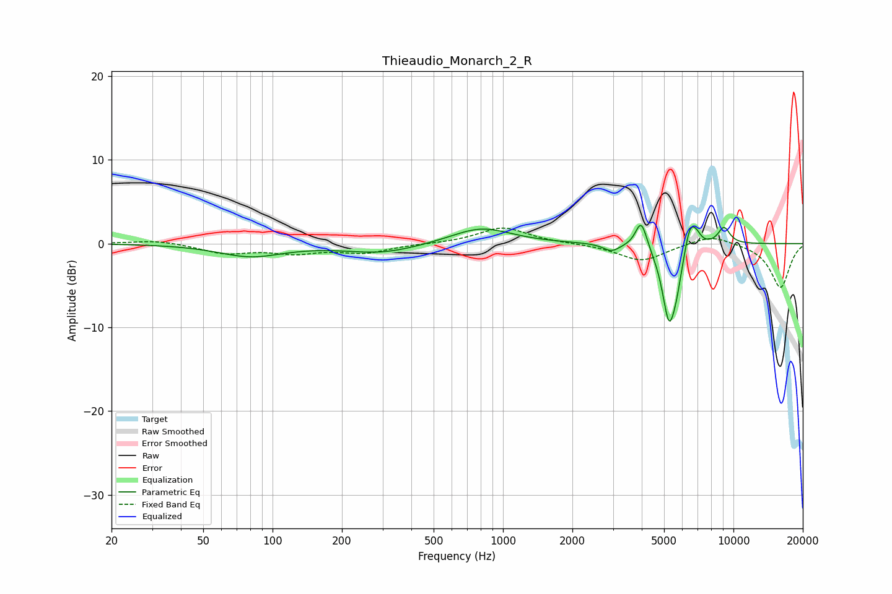

# Thieaudio_Monarch_2_R
See [usage instructions](https://github.com/jaakkopasanen/AutoEq#usage) for more options and info.

### Parametric EQs
Apply preamp of -2.3 dB when using parametric equalizer.

|   # | Type    |   Fc (Hz) |    Q |   Gain (dB) |
|-----|---------|-----------|------|-------------|
|   1 | Peaking |        80 | 1.02 |        -1.5 |
|   2 | Peaking |       299 | 0.9  |        -1.1 |
|   3 | Peaking |       804 | 1.1  |         2   |
|   4 | Peaking |      2957 | 4    |        -0.9 |
|   5 | Peaking |      3980 | 5.63 |         3.4 |
|   6 | Peaking |      5257 | 4.55 |        -9   |
|   7 | Peaking |      5683 | 6    |        -2.2 |
|   8 | Peaking |      6466 | 5.92 |         3   |
|   9 | Peaking |      6889 | 5.97 |         1.2 |
|  10 | Peaking |      9094 | 4.79 |         2   |

### Fixed Band EQs
When using fixed band (also called graphic) equalizer, apply preamp of **-1.9 dB** (if available) and set gains manually with these parameters.

|   # | Type    |   Fc (Hz) |    Q |   Gain (dB) |
|-----|---------|-----------|------|-------------|
|   1 | Peaking |        31 | 1.41 |         0.4 |
|   2 | Peaking |        62 | 1.41 |        -1.1 |
|   3 | Peaking |       125 | 1.41 |        -1   |
|   4 | Peaking |       250 | 1.41 |        -1   |
|   5 | Peaking |       500 | 1.41 |        -0   |
|   6 | Peaking |      1000 | 1.41 |         2   |
|   7 | Peaking |      2000 | 1.41 |         0   |
|   8 | Peaking |      4000 | 1.41 |        -2.1 |
|   9 | Peaking |      8000 | 1.41 |         1.1 |
|  10 | Peaking |     16000 | 1.41 |        -5.3 |

### Graphs

