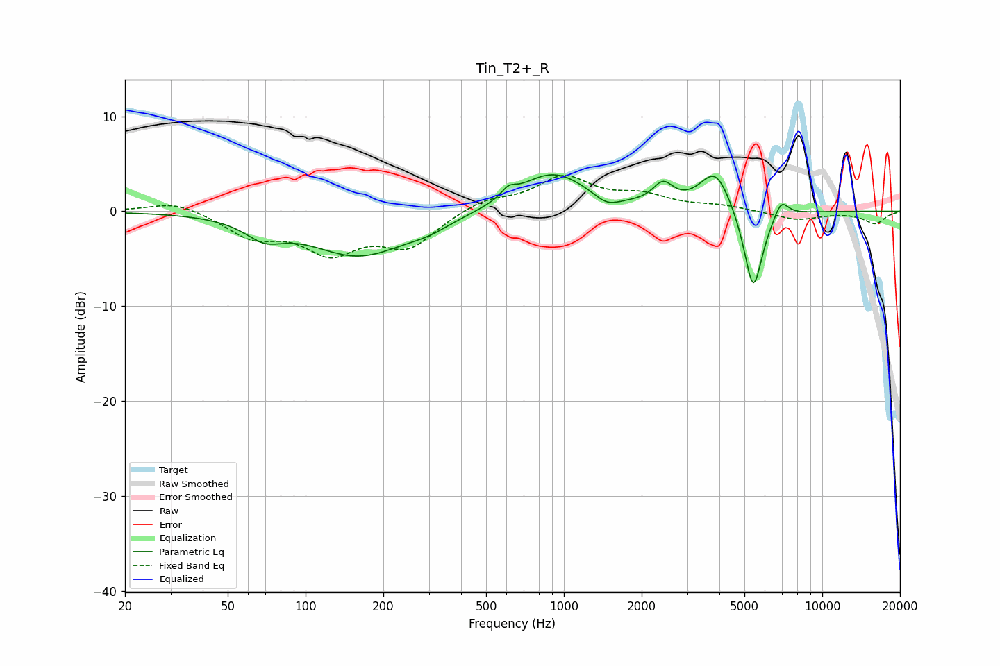

# Tin_T2+_R
See [usage instructions](https://github.com/jaakkopasanen/AutoEq#usage) for more options and info.

### Parametric EQs
Apply preamp of -3.9 dB when using parametric equalizer.

|   # | Type    |   Fc (Hz) |    Q |   Gain (dB) |
|-----|---------|-----------|------|-------------|
|   1 | Peaking |        69 | 1.94 |        -1.8 |
|   2 | Peaking |       161 | 0.74 |        -4.6 |
|   3 | Peaking |       300 | 1.68 |        -0.7 |
|   4 | Peaking |       611 | 5.13 |         0.9 |
|   5 | Peaking |       904 | 1.02 |         4.2 |
|   6 | Peaking |      1466 | 2.77 |        -1.1 |
|   7 | Peaking |      2420 | 3.61 |         2.2 |
|   8 | Peaking |      3862 | 2.33 |         4.4 |
|   9 | Peaking |      5408 | 3.76 |        -9   |
|  10 | Peaking |      6935 | 4.8  |         1.9 |

### Fixed Band EQs
When using fixed band (also called graphic) equalizer, apply preamp of **-3.9 dB** (if available) and set gains manually with these parameters.

|   # | Type    |   Fc (Hz) |    Q |   Gain (dB) |
|-----|---------|-----------|------|-------------|
|   1 | Peaking |        31 | 1.41 |         1.1 |
|   2 | Peaking |        62 | 1.41 |        -2.5 |
|   3 | Peaking |       125 | 1.41 |        -3.9 |
|   4 | Peaking |       250 | 1.41 |        -3.5 |
|   5 | Peaking |       500 | 1.41 |         1.2 |
|   6 | Peaking |      1000 | 1.41 |         3.4 |
|   7 | Peaking |      2000 | 1.41 |         1.4 |
|   8 | Peaking |      4000 | 1.41 |         0.5 |
|   9 | Peaking |      8000 | 1.41 |        -0.9 |
|  10 | Peaking |     16000 | 1.41 |        -1.3 |

### Graphs

