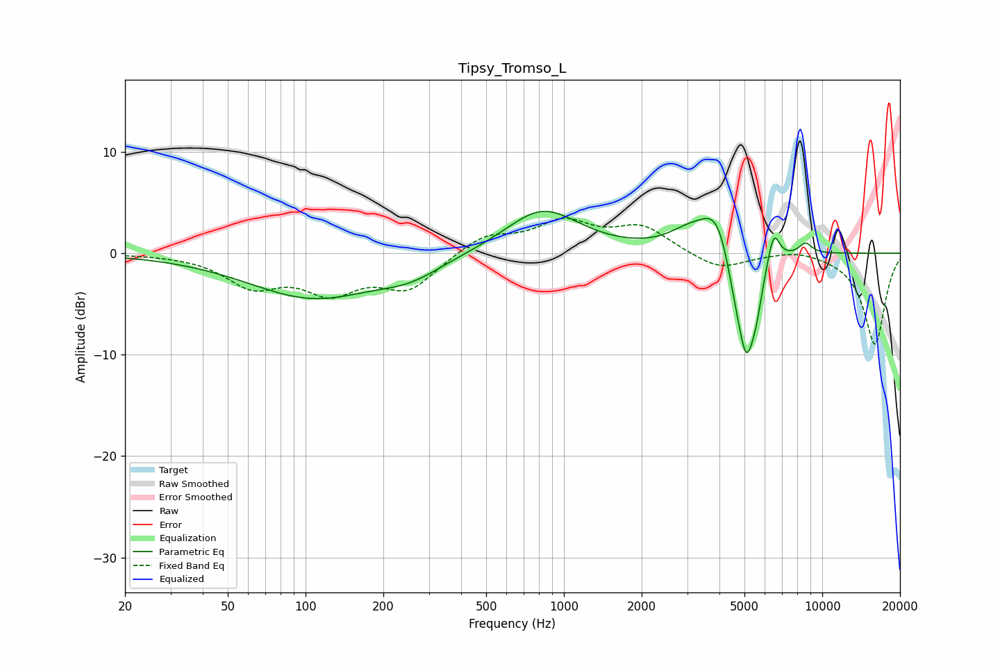

# Tipsy_Tromso_L
See [usage instructions](https://github.com/jaakkopasanen/AutoEq#usage) for more options and info.

### Parametric EQs
Apply preamp of -4.2 dB when using parametric equalizer.

|   # | Type    |   Fc (Hz) |    Q |   Gain (dB) |
|-----|---------|-----------|------|-------------|
|   1 | Peaking |       107 | 0.56 |        -4.3 |
|   2 | Peaking |       255 | 1.14 |        -1.4 |
|   3 | Peaking |       825 | 0.99 |         4.4 |
|   4 | Peaking |      3040 | 1.74 |         1.6 |
|   5 | Peaking |      3933 | 2.29 |         4.5 |
|   6 | Peaking |      4618 | 3.41 |        -3.2 |
|   7 | Peaking |      5095 | 3.92 |        -9.2 |
|   8 | Peaking |      5567 | 6    |        -2.4 |
|   9 | Peaking |      6485 | 5.98 |         3.2 |
|  10 | Peaking |      8617 | 5.12 |         1.1 |

### Fixed Band EQs
When using fixed band (also called graphic) equalizer, apply preamp of **-3.6 dB** (if available) and set gains manually with these parameters.

|   # | Type    |   Fc (Hz) |    Q |   Gain (dB) |
|-----|---------|-----------|------|-------------|
|   1 | Peaking |        31 | 1.41 |        -0   |
|   2 | Peaking |        62 | 1.41 |        -3   |
|   3 | Peaking |       125 | 1.41 |        -3.4 |
|   4 | Peaking |       250 | 1.41 |        -3.3 |
|   5 | Peaking |       500 | 1.41 |         1.8 |
|   6 | Peaking |      1000 | 1.41 |         2.9 |
|   7 | Peaking |      2000 | 1.41 |         2.5 |
|   8 | Peaking |      4000 | 1.41 |        -1.7 |
|   9 | Peaking |      8000 | 1.41 |         0.5 |
|  10 | Peaking |     16000 | 1.41 |        -9   |

### Graphs

