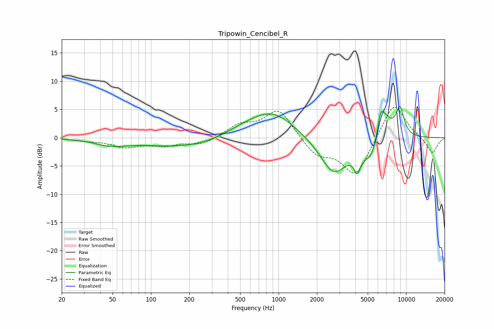

# Tripowin_Cencibel_R
See [usage instructions](https://github.com/jaakkopasanen/AutoEq#usage) for more options and info.

### Parametric EQs
Apply preamp of -5.7 dB when using parametric equalizer.

|   # | Type    |   Fc (Hz) |    Q |   Gain (dB) |
|-----|---------|-----------|------|-------------|
|   1 | Peaking |        48 | 1.14 |        -1.1 |
|   2 | Peaking |       192 | 0.42 |        -1.7 |
|   3 | Peaking |       509 | 0.93 |         1   |
|   4 | Peaking |       890 | 0.8  |         4.6 |
|   5 | Peaking |      2706 | 1.31 |        -6.5 |
|   6 | Peaking |      4135 | 5.53 |        -3   |
|   7 | Peaking |      5470 | 1.93 |        -5.1 |
|   8 | Peaking |      6266 | 5.99 |         2.6 |
|   9 | Peaking |      6553 | 2.15 |         6.1 |
|  10 | Peaking |      8930 | 3.92 |         4.9 |

### Fixed Band EQs
When using fixed band (also called graphic) equalizer, apply preamp of **-5.4 dB** (if available) and set gains manually with these parameters.

|   # | Type    |   Fc (Hz) |    Q |   Gain (dB) |
|-----|---------|-----------|------|-------------|
|   1 | Peaking |        31 | 1.41 |        -0.4 |
|   2 | Peaking |        62 | 1.41 |        -1.5 |
|   3 | Peaking |       125 | 1.41 |        -1.2 |
|   4 | Peaking |       250 | 1.41 |        -1.3 |
|   5 | Peaking |       500 | 1.41 |         2.1 |
|   6 | Peaking |      1000 | 1.41 |         5.1 |
|   7 | Peaking |      2000 | 1.41 |        -3   |
|   8 | Peaking |      4000 | 1.41 |        -6.8 |
|   9 | Peaking |      8000 | 1.41 |         6.6 |
|  10 | Peaking |     16000 | 1.41 |        -2.9 |

### Graphs

