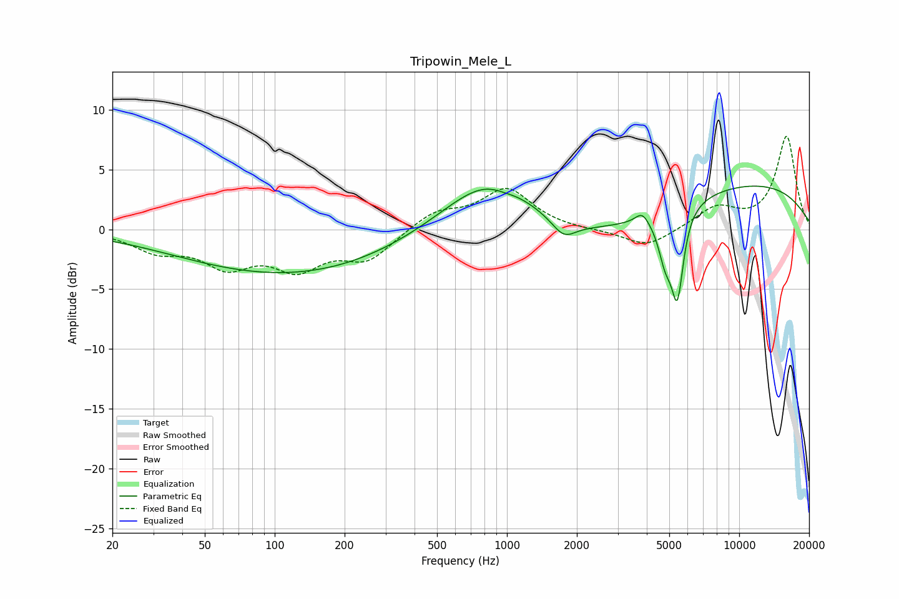

# Tripowin_Mele_L
See [usage instructions](https://github.com/jaakkopasanen/AutoEq#usage) for more options and info.

### Parametric EQs
Apply preamp of -3.7 dB when using parametric equalizer.

|   # | Type    |   Fc (Hz) |    Q |   Gain (dB) |
|-----|---------|-----------|------|-------------|
|   1 | Peaking |        97 | 0.34 |        -3.4 |
|   2 | Peaking |       784 | 0.19 |        -1.4 |
|   3 | Peaking |       861 | 0.65 |         6   |
|   4 | Peaking |       974 | 2.73 |        -0.3 |
|   5 | Peaking |      1757 | 2.81 |        -1.4 |
|   6 | Peaking |      2357 | 0.39 |        -1.7 |
|   7 | Peaking |      3824 | 4.92 |         0.9 |
|   8 | Peaking |      4810 | 4.44 |        -3.3 |
|   9 | Peaking |      5418 | 5.36 |        -6.9 |
|  10 | Peaking |      9544 | 0.26 |         4.1 |

### Fixed Band EQs
When using fixed band (also called graphic) equalizer, apply preamp of **-7.9 dB** (if available) and set gains manually with these parameters.

|   # | Type    |   Fc (Hz) |    Q |   Gain (dB) |
|-----|---------|-----------|------|-------------|
|   1 | Peaking |        31 | 1.41 |        -1.6 |
|   2 | Peaking |        62 | 1.41 |        -2.7 |
|   3 | Peaking |       125 | 1.41 |        -2.9 |
|   4 | Peaking |       250 | 1.41 |        -2.4 |
|   5 | Peaking |       500 | 1.41 |         1.5 |
|   6 | Peaking |      1000 | 1.41 |         3.3 |
|   7 | Peaking |      2000 | 1.41 |        -0.1 |
|   8 | Peaking |      4000 | 1.41 |        -1.5 |
|   9 | Peaking |      8000 | 1.41 |         1.8 |
|  10 | Peaking |     16000 | 1.41 |         7.8 |

### Graphs

