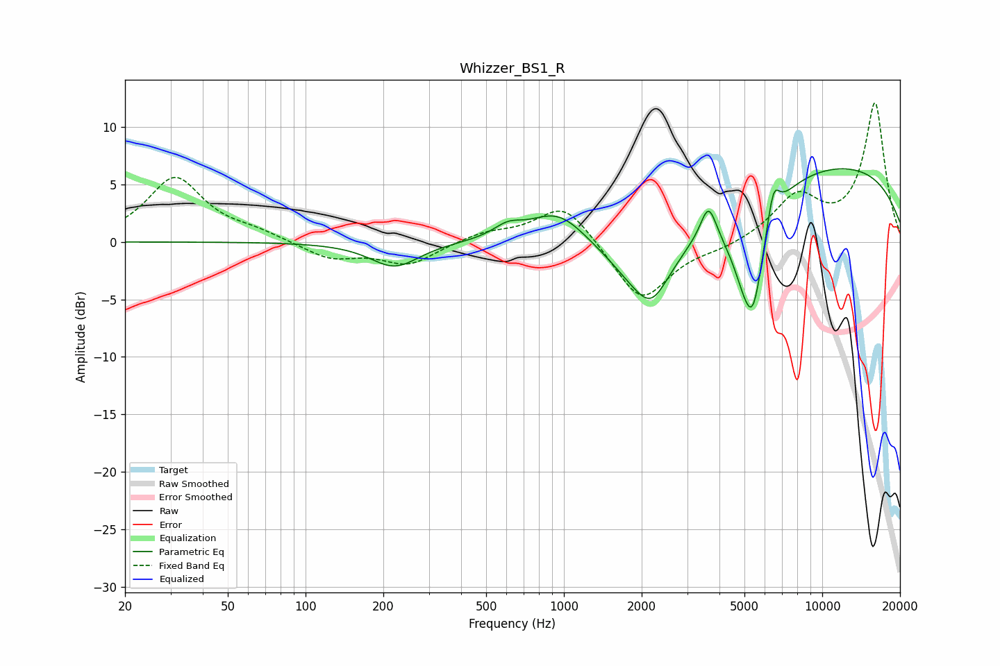

# Whizzer_BS1_R
See [usage instructions](https://github.com/jaakkopasanen/AutoEq#usage) for more options and info.

### Parametric EQs
Apply preamp of -6.4 dB when using parametric equalizer.

|   # | Type    |   Fc (Hz) |    Q |   Gain (dB) |
|-----|---------|-----------|------|-------------|
|   1 | Peaking |       221 | 1.5  |        -2.2 |
|   2 | Peaking |       607 | 2.52 |         1   |
|   3 | Peaking |       948 | 1.31 |         2.8 |
|   4 | Peaking |      2095 | 1.07 |        -6   |
|   5 | Peaking |      2193 | 2.61 |        -1.7 |
|   6 | Peaking |      3628 | 4.68 |         3   |
|   7 | Peaking |      5180 | 2.09 |        -8.5 |
|   8 | Peaking |      5433 | 4.54 |        -3   |
|   9 | Peaking |      6471 | 5.75 |         3   |
|  10 | Peaking |     10000 | 0.23 |         6.9 |

### Fixed Band EQs
When using fixed band (also called graphic) equalizer, apply preamp of **-12.2 dB** (if available) and set gains manually with these parameters.

|   # | Type    |   Fc (Hz) |    Q |   Gain (dB) |
|-----|---------|-----------|------|-------------|
|   1 | Peaking |        31 | 1.41 |         5.5 |
|   2 | Peaking |        62 | 1.41 |         0.7 |
|   3 | Peaking |       125 | 1.41 |        -1.4 |
|   4 | Peaking |       250 | 1.41 |        -1.9 |
|   5 | Peaking |       500 | 1.41 |         0.8 |
|   6 | Peaking |      1000 | 1.41 |         3.5 |
|   7 | Peaking |      2000 | 1.41 |        -5.3 |
|   8 | Peaking |      4000 | 1.41 |        -0.5 |
|   9 | Peaking |      8000 | 1.41 |         3.8 |
|  10 | Peaking |     16000 | 1.41 |        12   |

### Graphs

