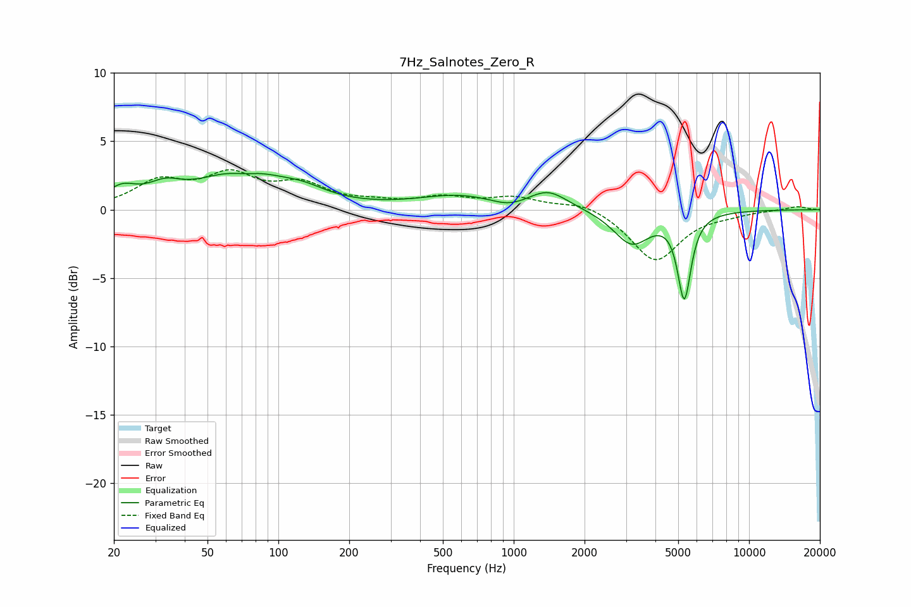

# 7Hz_Salnotes_Zero_R
See [usage instructions](https://github.com/jaakkopasanen/AutoEq#usage) for more options and info.

### Parametric EQs
Apply preamp of -2.7 dB when using parametric equalizer.

|   # | Type    |   Fc (Hz) |    Q |   Gain (dB) |
|-----|---------|-----------|------|-------------|
|   1 | Peaking |        22 | 2.2  |         1.2 |
|   2 | Peaking |        33 | 2.03 |         1   |
|   3 | Peaking |        70 | 0.8  |         2.8 |
|   4 | Peaking |        71 | 2.16 |        -0.5 |
|   5 | Peaking |       129 | 1.46 |         0.6 |
|   6 | Peaking |       592 | 0.79 |         1   |
|   7 | Peaking |       955 | 1.82 |        -0.5 |
|   8 | Peaking |      1399 | 1.7  |         1.3 |
|   9 | Peaking |      3172 | 1.83 |        -2.5 |
|  10 | Peaking |      5306 | 4.95 |        -6.1 |

### Fixed Band EQs
When using fixed band (also called graphic) equalizer, apply preamp of **-3.0 dB** (if available) and set gains manually with these parameters.

|   # | Type    |   Fc (Hz) |    Q |   Gain (dB) |
|-----|---------|-----------|------|-------------|
|   1 | Peaking |        31 | 1.41 |         1.9 |
|   2 | Peaking |        62 | 1.41 |         2.3 |
|   3 | Peaking |       125 | 1.41 |         1.6 |
|   4 | Peaking |       250 | 1.41 |         0.4 |
|   5 | Peaking |       500 | 1.41 |         0.8 |
|   6 | Peaking |      1000 | 1.41 |         0.8 |
|   7 | Peaking |      2000 | 1.41 |         0.6 |
|   8 | Peaking |      4000 | 1.41 |        -3.8 |
|   9 | Peaking |      8000 | 1.41 |        -0.2 |
|  10 | Peaking |     16000 | 1.41 |         0.3 |

### Graphs

