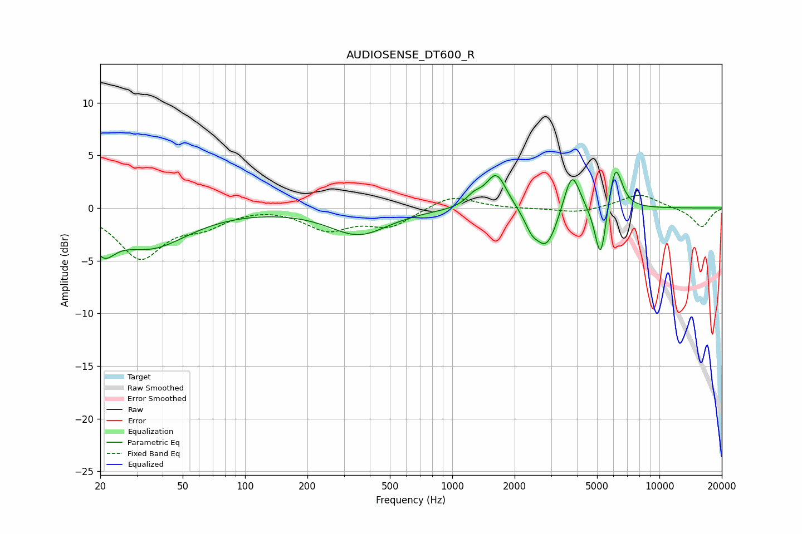

# AUDIOSENSE_DT600_R
See [usage instructions](https://github.com/jaakkopasanen/AutoEq#usage) for more options and info.

### Parametric EQs
Apply preamp of -3.5 dB when using parametric equalizer.

|   # | Type    |   Fc (Hz) |    Q |   Gain (dB) |
|-----|---------|-----------|------|-------------|
|   1 | Peaking |        21 | 2.62 |        -2.6 |
|   2 | Peaking |        35 | 0.78 |        -3.6 |
|   3 | Peaking |       353 | 1    |        -2.5 |
|   4 | Peaking |      1274 | 3.6  |         0.9 |
|   5 | Peaking |      1635 | 2.85 |         3.4 |
|   6 | Peaking |      2414 | 4.37 |        -1.2 |
|   7 | Peaking |      2852 | 2.6  |        -3.9 |
|   8 | Peaking |      3780 | 3.61 |         4   |
|   9 | Peaking |      5205 | 5.01 |        -5.6 |
|  10 | Peaking |      6122 | 4.22 |         4.6 |

### Fixed Band EQs
When using fixed band (also called graphic) equalizer, apply preamp of **-1.3 dB** (if available) and set gains manually with these parameters.

|   # | Type    |   Fc (Hz) |    Q |   Gain (dB) |
|-----|---------|-----------|------|-------------|
|   1 | Peaking |        31 | 1.41 |        -4.6 |
|   2 | Peaking |        62 | 1.41 |        -1.4 |
|   3 | Peaking |       125 | 1.41 |         0.2 |
|   4 | Peaking |       250 | 1.41 |        -1.9 |
|   5 | Peaking |       500 | 1.41 |        -1.7 |
|   6 | Peaking |      1000 | 1.41 |         1.3 |
|   7 | Peaking |      2000 | 1.41 |        -0.1 |
|   8 | Peaking |      4000 | 1.41 |        -0.5 |
|   9 | Peaking |      8000 | 1.41 |         1.4 |
|  10 | Peaking |     16000 | 1.41 |        -1.8 |

### Graphs

