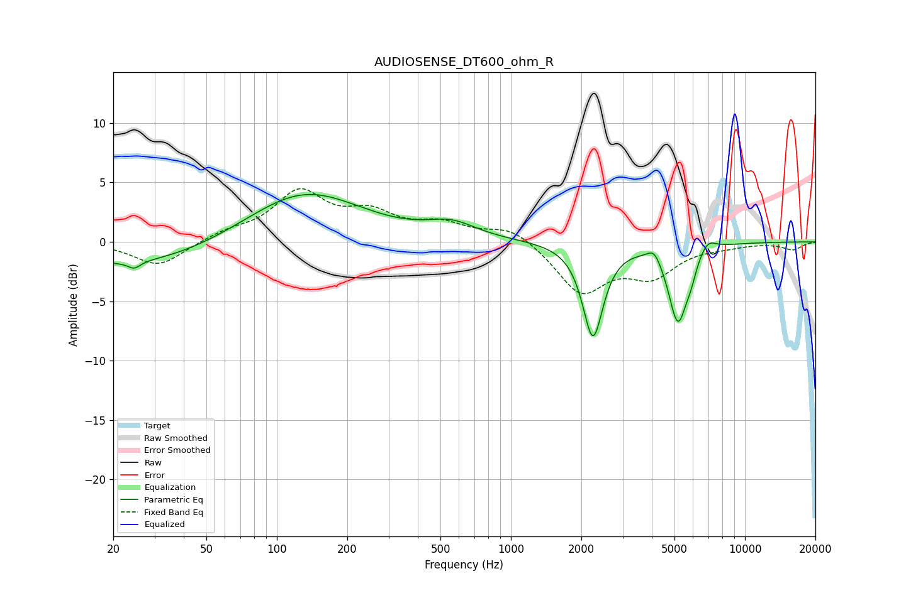

# AUDIOSENSE_DT600_ohm_R
See [usage instructions](https://github.com/jaakkopasanen/AutoEq#usage) for more options and info.

### Parametric EQs
Apply preamp of -4.1 dB when using parametric equalizer.

|   # | Type    |   Fc (Hz) |    Q |   Gain (dB) |
|-----|---------|-----------|------|-------------|
|   1 | Peaking |        24 | 5.99 |         1.4 |
|   2 | Peaking |        24 | 5.82 |        -2   |
|   3 | Peaking |        25 | 0.39 |        -2.1 |
|   4 | Peaking |       130 | 0.57 |         4.4 |
|   5 | Peaking |       559 | 1.33 |         1.2 |
|   6 | Peaking |      2242 | 3.24 |        -7.9 |
|   7 | Peaking |      4098 | 5.05 |         1   |
|   8 | Peaking |      5171 | 3.48 |        -6.5 |
|   9 | Peaking |      5879 | 6    |        -1.1 |
|  10 | Peaking |      6922 | 3.84 |         1   |

### Fixed Band EQs
When using fixed band (also called graphic) equalizer, apply preamp of **-4.6 dB** (if available) and set gains manually with these parameters.

|   # | Type    |   Fc (Hz) |    Q |   Gain (dB) |
|-----|---------|-----------|------|-------------|
|   1 | Peaking |        31 | 1.41 |        -2.1 |
|   2 | Peaking |        62 | 1.41 |         0.7 |
|   3 | Peaking |       125 | 1.41 |         4   |
|   4 | Peaking |       250 | 1.41 |         2   |
|   5 | Peaking |       500 | 1.41 |         1.3 |
|   6 | Peaking |      1000 | 1.41 |         1.3 |
|   7 | Peaking |      2000 | 1.41 |        -4.2 |
|   8 | Peaking |      4000 | 1.41 |        -2.6 |
|   9 | Peaking |      8000 | 1.41 |        -0.3 |
|  10 | Peaking |     16000 | 1.41 |        -0.6 |

### Graphs

