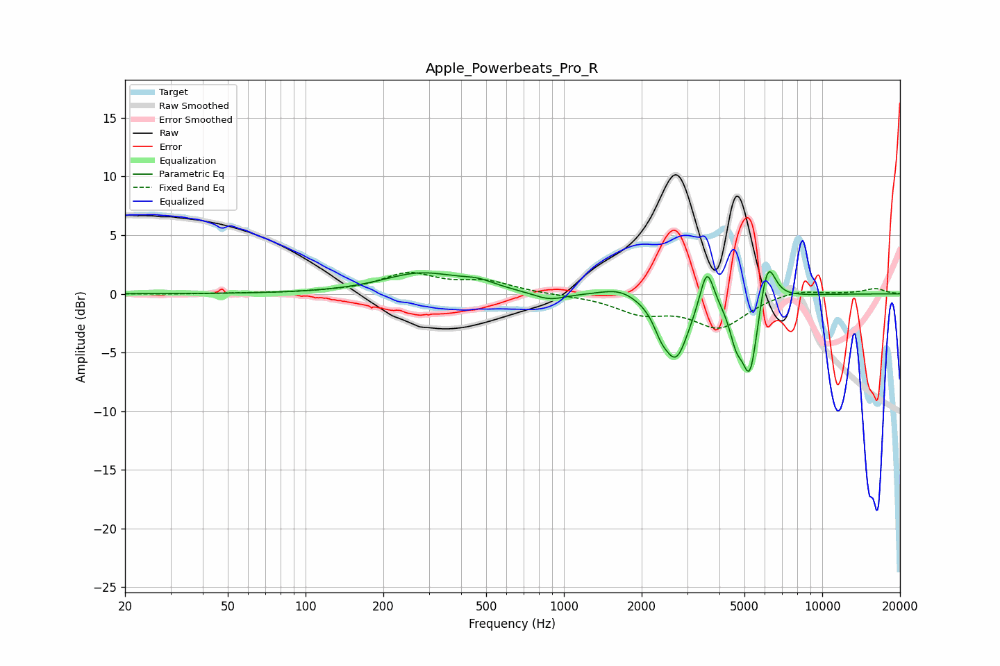

# Apple_Powerbeats_Pro_R
See [usage instructions](https://github.com/jaakkopasanen/AutoEq#usage) for more options and info.

### Parametric EQs
Apply preamp of -2.0 dB when using parametric equalizer.

|   # | Type    |   Fc (Hz) |    Q |   Gain (dB) |
|-----|---------|-----------|------|-------------|
|   1 | Peaking |       279 | 0.95 |         1.7 |
|   2 | Peaking |       465 | 2.08 |         0.6 |
|   3 | Peaking |       879 | 2.24 |        -0.7 |
|   4 | Peaking |      1645 | 1.99 |         0.7 |
|   5 | Peaking |      2370 | 5.18 |        -1.1 |
|   6 | Peaking |      2714 | 2.81 |        -5.3 |
|   7 | Peaking |      3577 | 5.31 |         3.6 |
|   8 | Peaking |      4638 | 5.47 |        -2.5 |
|   9 | Peaking |      5251 | 4.42 |        -6.8 |
|  10 | Peaking |      6139 | 4.52 |         4   |

### Fixed Band EQs
When using fixed band (also called graphic) equalizer, apply preamp of **-1.9 dB** (if available) and set gains manually with these parameters.

|   # | Type    |   Fc (Hz) |    Q |   Gain (dB) |
|-----|---------|-----------|------|-------------|
|   1 | Peaking |        31 | 1.41 |        -0   |
|   2 | Peaking |        62 | 1.41 |         0   |
|   3 | Peaking |       125 | 1.41 |         0.1 |
|   4 | Peaking |       250 | 1.41 |         1.6 |
|   5 | Peaking |       500 | 1.41 |         1   |
|   6 | Peaking |      1000 | 1.41 |        -0.1 |
|   7 | Peaking |      2000 | 1.41 |        -1.5 |
|   8 | Peaking |      4000 | 1.41 |        -2.7 |
|   9 | Peaking |      8000 | 1.41 |         0.5 |
|  10 | Peaking |     16000 | 1.41 |         0.5 |

### Graphs

