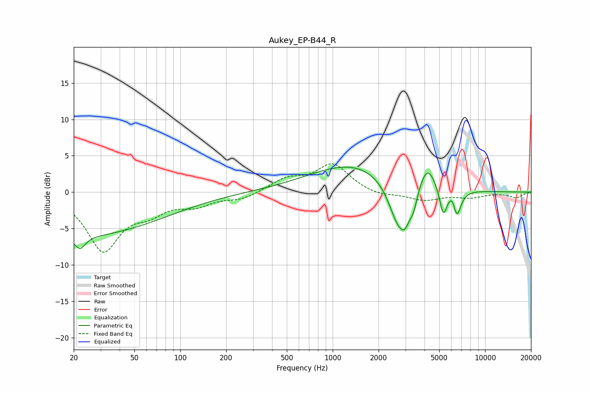

# Aukey_EP-B44_R
See [usage instructions](https://github.com/jaakkopasanen/AutoEq#usage) for more options and info.

### Parametric EQs
Apply preamp of -3.5 dB when using parametric equalizer.

|   # | Type    |   Fc (Hz) |    Q |   Gain (dB) |
|-----|---------|-----------|------|-------------|
|   1 | Peaking |        20 | 0.23 |        -6   |
|   2 | Peaking |        22 | 4.23 |        -1.7 |
|   3 | Peaking |      1403 | 0.48 |         4   |
|   4 | Peaking |      2699 | 2.13 |        -6.4 |
|   5 | Peaking |      2987 | 4.75 |        -2.1 |
|   6 | Peaking |      3387 | 5.54 |        -2.1 |
|   7 | Peaking |      4178 | 2.67 |         3.4 |
|   8 | Peaking |      5319 | 5.62 |        -3.8 |
|   9 | Peaking |      6169 | 5.78 |         1.7 |
|  10 | Peaking |      6489 | 4.89 |        -4.2 |

### Fixed Band EQs
When using fixed band (also called graphic) equalizer, apply preamp of **-4.0 dB** (if available) and set gains manually with these parameters.

|   # | Type    |   Fc (Hz) |    Q |   Gain (dB) |
|-----|---------|-----------|------|-------------|
|   1 | Peaking |        31 | 1.41 |        -7.8 |
|   2 | Peaking |        62 | 1.41 |        -2.1 |
|   3 | Peaking |       125 | 1.41 |        -1.5 |
|   4 | Peaking |       250 | 1.41 |        -0.9 |
|   5 | Peaking |       500 | 1.41 |         1.7 |
|   6 | Peaking |      1000 | 1.41 |         3.8 |
|   7 | Peaking |      2000 | 1.41 |        -0.6 |
|   8 | Peaking |      4000 | 1.41 |        -1.1 |
|   9 | Peaking |      8000 | 1.41 |        -0.7 |
|  10 | Peaking |     16000 | 1.41 |        -0.7 |

### Graphs

