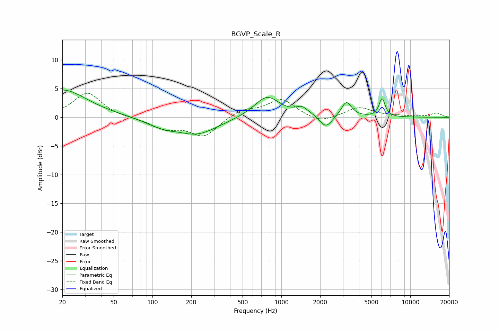

# BGVP_Scale_R
See [usage instructions](https://github.com/jaakkopasanen/AutoEq#usage) for more options and info.

### Parametric EQs
Apply preamp of -4.9 dB when using parametric equalizer.

|   # | Type    |   Fc (Hz) |    Q |   Gain (dB) |
|-----|---------|-----------|------|-------------|
|   1 | Peaking |        20 | 0.74 |         4.8 |
|   2 | Peaking |       113 | 1.26 |        -1.1 |
|   3 | Peaking |       136 | 4.04 |        -0.1 |
|   4 | Peaking |       220 | 0.87 |        -2.9 |
|   5 | Peaking |       773 | 1.43 |         3.7 |
|   6 | Peaking |      1436 | 3.02 |         1.2 |
|   7 | Peaking |      1667 | 2.33 |         0.2 |
|   8 | Peaking |      2218 | 3.02 |        -2.1 |
|   9 | Peaking |      3195 | 3.61 |         2.7 |
|  10 | Peaking |      6043 | 5.92 |         3.2 |

### Fixed Band EQs
When using fixed band (also called graphic) equalizer, apply preamp of **-4.3 dB** (if available) and set gains manually with these parameters.

|   # | Type    |   Fc (Hz) |    Q |   Gain (dB) |
|-----|---------|-----------|------|-------------|
|   1 | Peaking |        31 | 1.41 |         4.3 |
|   2 | Peaking |        62 | 1.41 |        -0.1 |
|   3 | Peaking |       125 | 1.41 |        -1.9 |
|   4 | Peaking |       250 | 1.41 |        -3.2 |
|   5 | Peaking |       500 | 1.41 |         1.3 |
|   6 | Peaking |      1000 | 1.41 |         3.1 |
|   7 | Peaking |      2000 | 1.41 |        -1.1 |
|   8 | Peaking |      4000 | 1.41 |         1.7 |
|   9 | Peaking |      8000 | 1.41 |         0.2 |
|  10 | Peaking |     16000 | 1.41 |         0.7 |

### Graphs

