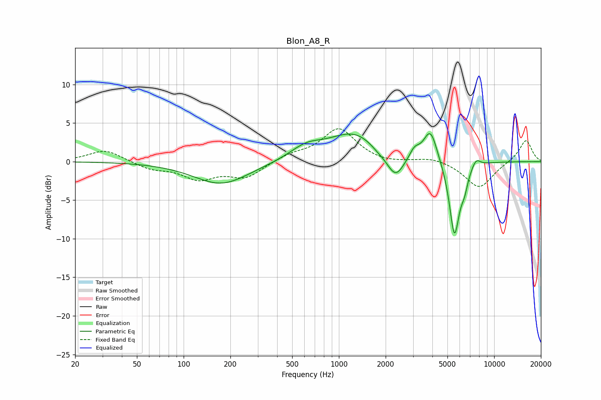

# Blon_A8_R
See [usage instructions](https://github.com/jaakkopasanen/AutoEq#usage) for more options and info.

### Parametric EQs
Apply preamp of -3.7 dB when using parametric equalizer.

|   # | Type    |   Fc (Hz) |    Q |   Gain (dB) |
|-----|---------|-----------|------|-------------|
|   1 | Peaking |       175 | 0.79 |        -3   |
|   2 | Peaking |       614 | 1.34 |         1.5 |
|   3 | Peaking |      1271 | 0.83 |         3.7 |
|   4 | Peaking |      1786 | 2.37 |        -0.6 |
|   5 | Peaking |      2315 | 2.49 |        -3.3 |
|   6 | Peaking |      3066 | 4.38 |         1.2 |
|   7 | Peaking |      3887 | 3.21 |         4.2 |
|   8 | Peaking |      5549 | 4.11 |        -9.8 |
|   9 | Peaking |      6434 | 6    |        -1.8 |
|  10 | Peaking |      7639 | 4.85 |         1.1 |

### Fixed Band EQs
When using fixed band (also called graphic) equalizer, apply preamp of **-4.4 dB** (if available) and set gains manually with these parameters.

|   # | Type    |   Fc (Hz) |    Q |   Gain (dB) |
|-----|---------|-----------|------|-------------|
|   1 | Peaking |        31 | 1.41 |         1.6 |
|   2 | Peaking |        62 | 1.41 |        -0.9 |
|   3 | Peaking |       125 | 1.41 |        -2.1 |
|   4 | Peaking |       250 | 1.41 |        -2   |
|   5 | Peaking |       500 | 1.41 |         0.8 |
|   6 | Peaking |      1000 | 1.41 |         4.2 |
|   7 | Peaking |      2000 | 1.41 |        -0.3 |
|   8 | Peaking |      4000 | 1.41 |         0.6 |
|   9 | Peaking |      8000 | 1.41 |        -3.5 |
|  10 | Peaking |     16000 | 1.41 |         2.9 |

### Graphs

