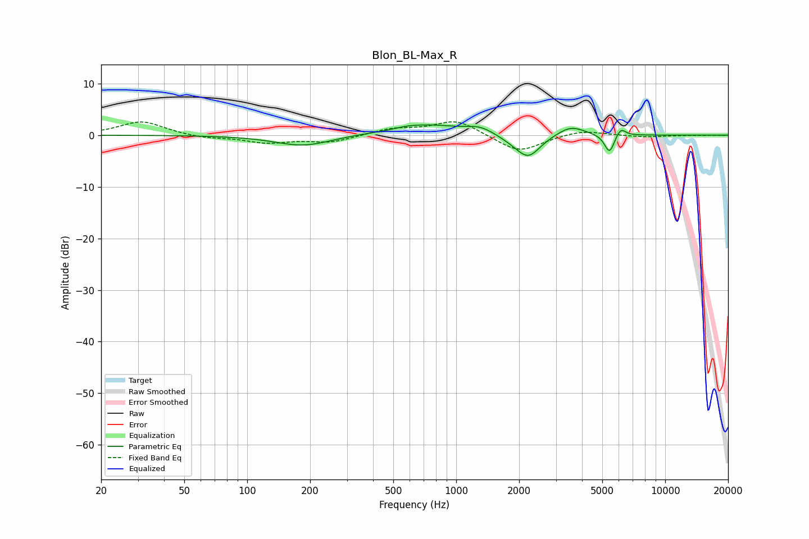

# Blon_BL-Max_R
See [usage instructions](https://github.com/jaakkopasanen/AutoEq#usage) for more options and info.

### Parametric EQs
Apply preamp of -2.1 dB when using parametric equalizer.

|   # | Type    |   Fc (Hz) |    Q |   Gain (dB) |
|-----|---------|-----------|------|-------------|
|   1 | Peaking |       185 | 1.05 |        -2.1 |
|   2 | Peaking |       348 | 1.49 |         0.2 |
|   3 | Peaking |       572 | 2.26 |         0.4 |
|   4 | Peaking |       739 | 0.95 |         1.9 |
|   5 | Peaking |      1300 | 2.04 |         1.4 |
|   6 | Peaking |      1912 | 1.87 |        -0.9 |
|   7 | Peaking |      2219 | 2.47 |        -4   |
|   8 | Peaking |      3539 | 2.13 |         1.9 |
|   9 | Peaking |      5413 | 5.98 |        -3.7 |
|  10 | Peaking |      6123 | 6    |         1.7 |

### Fixed Band EQs
When using fixed band (also called graphic) equalizer, apply preamp of **-2.7 dB** (if available) and set gains manually with these parameters.

|   # | Type    |   Fc (Hz) |    Q |   Gain (dB) |
|-----|---------|-----------|------|-------------|
|   1 | Peaking |        31 | 1.41 |         2.7 |
|   2 | Peaking |        62 | 1.41 |        -0.6 |
|   3 | Peaking |       125 | 1.41 |        -1.4 |
|   4 | Peaking |       250 | 1.41 |        -1.3 |
|   5 | Peaking |       500 | 1.41 |         1.2 |
|   6 | Peaking |      1000 | 1.41 |         3   |
|   7 | Peaking |      2000 | 1.41 |        -3.4 |
|   8 | Peaking |      4000 | 1.41 |         1.1 |
|   9 | Peaking |      8000 | 1.41 |        -0.4 |
|  10 | Peaking |     16000 | 1.41 |        -0   |

### Graphs

