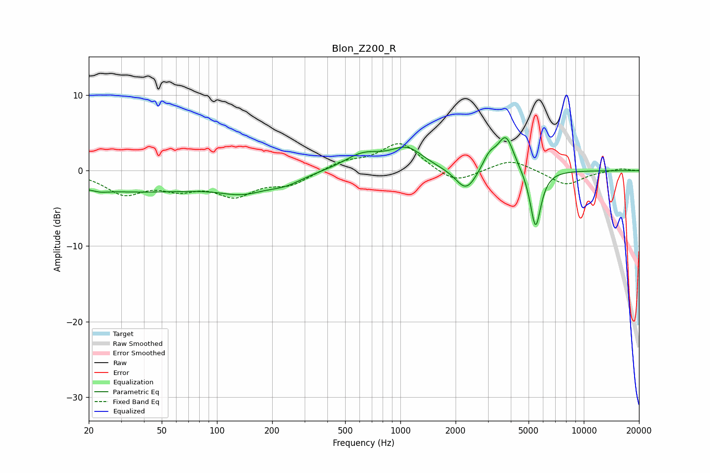

# Blon_Z200_R
See [usage instructions](https://github.com/jaakkopasanen/AutoEq#usage) for more options and info.

### Parametric EQs
Apply preamp of -4.5 dB when using parametric equalizer.

|   # | Type    |   Fc (Hz) |    Q |   Gain (dB) |
|-----|---------|-----------|------|-------------|
|   1 | Peaking |        23 | 3.53 |        -0.3 |
|   2 | Peaking |        35 | 0.3  |        -2.7 |
|   3 | Peaking |       139 | 1.12 |        -1.7 |
|   4 | Peaking |       235 | 1.46 |        -1.1 |
|   5 | Peaking |       625 | 1.34 |         2.1 |
|   6 | Peaking |      1088 | 1.57 |         2.7 |
|   7 | Peaking |      2286 | 2.45 |        -3.1 |
|   8 | Peaking |      3054 | 3.67 |         1.9 |
|   9 | Peaking |      3761 | 3.16 |         4.6 |
|  10 | Peaking |      5460 | 4.64 |        -7.8 |

### Fixed Band EQs
When using fixed band (also called graphic) equalizer, apply preamp of **-3.7 dB** (if available) and set gains manually with these parameters.

|   # | Type    |   Fc (Hz) |    Q |   Gain (dB) |
|-----|---------|-----------|------|-------------|
|   1 | Peaking |        31 | 1.41 |        -2.8 |
|   2 | Peaking |        62 | 1.41 |        -1.9 |
|   3 | Peaking |       125 | 1.41 |        -2.9 |
|   4 | Peaking |       250 | 1.41 |        -1.7 |
|   5 | Peaking |       500 | 1.41 |         1.1 |
|   6 | Peaking |      1000 | 1.41 |         3.7 |
|   7 | Peaking |      2000 | 1.41 |        -1.9 |
|   8 | Peaking |      4000 | 1.41 |         1.6 |
|   9 | Peaking |      8000 | 1.41 |        -1.9 |
|  10 | Peaking |     16000 | 1.41 |         0.3 |

### Graphs

