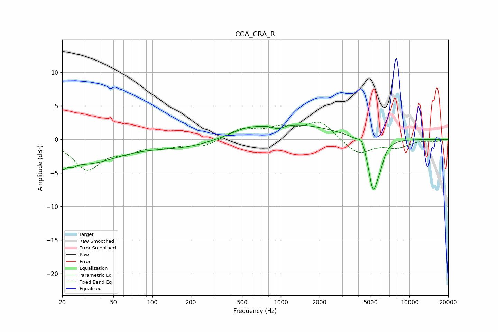

# CCA_CRA_R
See [usage instructions](https://github.com/jaakkopasanen/AutoEq#usage) for more options and info.

### Parametric EQs
Apply preamp of -2.2 dB when using parametric equalizer.

|   # | Type    |   Fc (Hz) |    Q |   Gain (dB) |
|-----|---------|-----------|------|-------------|
|   1 | Peaking |        20 | 5.84 |        -1.4 |
|   2 | Peaking |        24 | 5.59 |        -0.6 |
|   3 | Peaking |        30 | 0.56 |        -3.4 |
|   4 | Peaking |       183 | 0.51 |        -1.2 |
|   5 | Peaking |       525 | 1.39 |         0.5 |
|   6 | Peaking |       955 | 3.37 |        -0.7 |
|   7 | Peaking |      1115 | 0.39 |         2.4 |
|   8 | Peaking |      4244 | 5.91 |         1.1 |
|   9 | Peaking |      5226 | 3.65 |        -7.6 |
|  10 | Peaking |      5959 | 4.85 |        -1.6 |

### Fixed Band EQs
When using fixed band (also called graphic) equalizer, apply preamp of **-2.7 dB** (if available) and set gains manually with these parameters.

|   # | Type    |   Fc (Hz) |    Q |   Gain (dB) |
|-----|---------|-----------|------|-------------|
|   1 | Peaking |        31 | 1.41 |        -4.3 |
|   2 | Peaking |        62 | 1.41 |        -1.4 |
|   3 | Peaking |       125 | 1.41 |        -0.9 |
|   4 | Peaking |       250 | 1.41 |        -1   |
|   5 | Peaking |       500 | 1.41 |         1.5 |
|   6 | Peaking |      1000 | 1.41 |         1.5 |
|   7 | Peaking |      2000 | 1.41 |         2.6 |
|   8 | Peaking |      4000 | 1.41 |        -2.3 |
|   9 | Peaking |      8000 | 1.41 |        -1.1 |
|  10 | Peaking |     16000 | 1.41 |        -0.2 |

### Graphs

