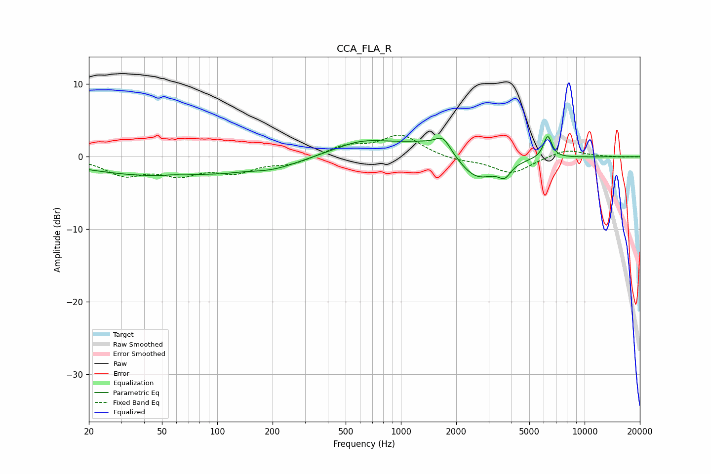

# CCA_FLA_R
See [usage instructions](https://github.com/jaakkopasanen/AutoEq#usage) for more options and info.

### Parametric EQs
Apply preamp of -2.8 dB when using parametric equalizer.

|   # | Type    |   Fc (Hz) |    Q |   Gain (dB) |
|-----|---------|-----------|------|-------------|
|   1 | Peaking |        46 | 0.35 |        -2.6 |
|   2 | Peaking |        57 | 3.77 |         0.1 |
|   3 | Peaking |       107 | 2.16 |        -0.2 |
|   4 | Peaking |       200 | 0.97 |        -1.2 |
|   5 | Peaking |       604 | 0.93 |         1.8 |
|   6 | Peaking |      1624 | 0.7  |         2.8 |
|   7 | Peaking |      1698 | 3.5  |         1.8 |
|   8 | Peaking |      2548 | 1.19 |        -4.7 |
|   9 | Peaking |      3671 | 4.23 |        -1.6 |
|  10 | Peaking |      6292 | 6    |         3.1 |

### Fixed Band EQs
When using fixed band (also called graphic) equalizer, apply preamp of **-3.1 dB** (if available) and set gains manually with these parameters.

|   # | Type    |   Fc (Hz) |    Q |   Gain (dB) |
|-----|---------|-----------|------|-------------|
|   1 | Peaking |        31 | 1.41 |        -2.3 |
|   2 | Peaking |        62 | 1.41 |        -2.1 |
|   3 | Peaking |       125 | 1.41 |        -1.9 |
|   4 | Peaking |       250 | 1.41 |        -1   |
|   5 | Peaking |       500 | 1.41 |         1.4 |
|   6 | Peaking |      1000 | 1.41 |         2.9 |
|   7 | Peaking |      2000 | 1.41 |        -0.5 |
|   8 | Peaking |      4000 | 1.41 |        -2.3 |
|   9 | Peaking |      8000 | 1.41 |         1.1 |
|  10 | Peaking |     16000 | 1.41 |        -0   |

### Graphs

