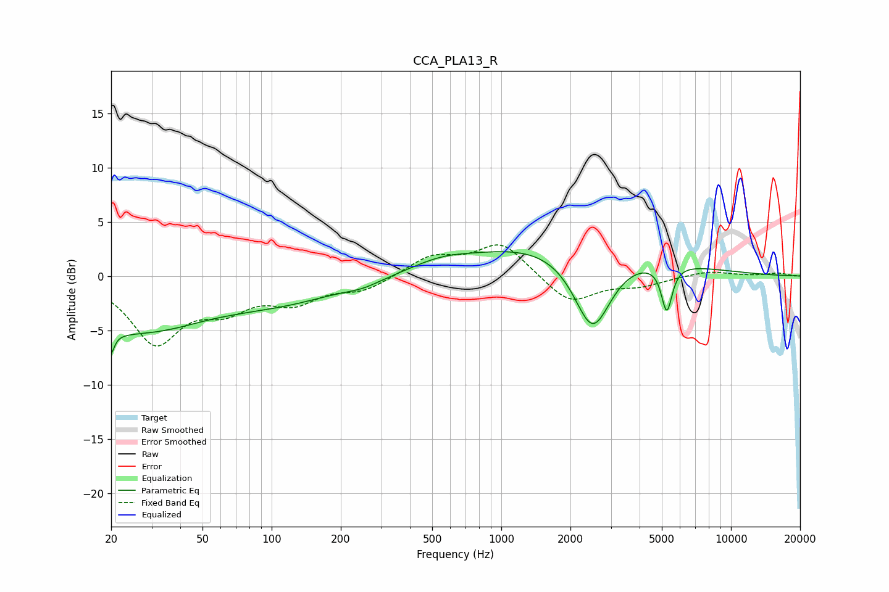

# CCA_PLA13_R
See [usage instructions](https://github.com/jaakkopasanen/AutoEq#usage) for more options and info.

### Parametric EQs
Apply preamp of -2.3 dB when using parametric equalizer.

|   # | Type    |   Fc (Hz) |    Q |   Gain (dB) |
|-----|---------|-----------|------|-------------|
|   1 | Peaking |        20 | 5.62 |        -5.4 |
|   2 | Peaking |        20 | 5.66 |         3.2 |
|   3 | Peaking |        26 | 0.43 |        -4.9 |
|   4 | Peaking |        52 | 1.43 |         0.1 |
|   5 | Peaking |       120 | 0.58 |        -1.7 |
|   6 | Peaking |       249 | 1.79 |        -0.5 |
|   7 | Peaking |       542 | 1.14 |         0.7 |
|   8 | Peaking |      1940 | 0.34 |         3.4 |
|   9 | Peaking |      2496 | 1.68 |        -7.6 |
|  10 | Peaking |      5255 | 6    |        -4.3 |

### Fixed Band EQs
When using fixed band (also called graphic) equalizer, apply preamp of **-3.0 dB** (if available) and set gains manually with these parameters.

|   # | Type    |   Fc (Hz) |    Q |   Gain (dB) |
|-----|---------|-----------|------|-------------|
|   1 | Peaking |        31 | 1.41 |        -5.9 |
|   2 | Peaking |        62 | 1.41 |        -2.4 |
|   3 | Peaking |       125 | 1.41 |        -2.1 |
|   4 | Peaking |       250 | 1.41 |        -1.2 |
|   5 | Peaking |       500 | 1.41 |         1.8 |
|   6 | Peaking |      1000 | 1.41 |         3.1 |
|   7 | Peaking |      2000 | 1.41 |        -2.6 |
|   8 | Peaking |      4000 | 1.41 |        -0.8 |
|   9 | Peaking |      8000 | 1.41 |         0.5 |
|  10 | Peaking |     16000 | 1.41 |         0.3 |

### Graphs

