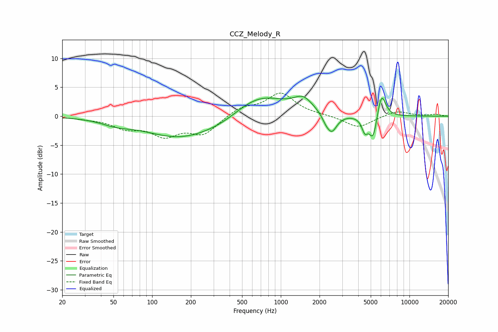

# CCZ_Melody_R
See [usage instructions](https://github.com/jaakkopasanen/AutoEq#usage) for more options and info.

### Parametric EQs
Apply preamp of -3.5 dB when using parametric equalizer.

|   # | Type    |   Fc (Hz) |    Q |   Gain (dB) |
|-----|---------|-----------|------|-------------|
|   1 | Peaking |        52 | 1.29 |        -0.8 |
|   2 | Peaking |       166 | 0.51 |        -3.7 |
|   3 | Peaking |       360 | 0.87 |        -0.9 |
|   4 | Peaking |       673 | 0.68 |         3.9 |
|   5 | Peaking |      1496 | 1.92 |         2.3 |
|   6 | Peaking |      2227 | 5.25 |        -0.7 |
|   7 | Peaking |      2481 | 3.4  |        -3.2 |
|   8 | Peaking |      4499 | 5.92 |        -2.3 |
|   9 | Peaking |      5219 | 4.53 |        -4.3 |
|  10 | Peaking |      6058 | 4.23 |         4.4 |

### Fixed Band EQs
When using fixed band (also called graphic) equalizer, apply preamp of **-4.1 dB** (if available) and set gains manually with these parameters.

|   # | Type    |   Fc (Hz) |    Q |   Gain (dB) |
|-----|---------|-----------|------|-------------|
|   1 | Peaking |        31 | 1.41 |        -0.3 |
|   2 | Peaking |        62 | 1.41 |        -1.8 |
|   3 | Peaking |       125 | 1.41 |        -3   |
|   4 | Peaking |       250 | 1.41 |        -2.9 |
|   5 | Peaking |       500 | 1.41 |         1.5 |
|   6 | Peaking |      1000 | 1.41 |         3.9 |
|   7 | Peaking |      2000 | 1.41 |         0.1 |
|   8 | Peaking |      4000 | 1.41 |        -2   |
|   9 | Peaking |      8000 | 1.41 |         1   |
|  10 | Peaking |     16000 | 1.41 |         0.3 |

### Graphs

