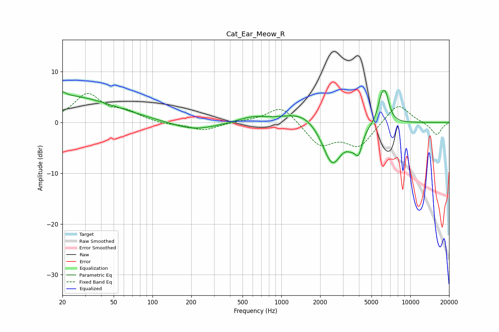

# Cat_Ear_Meow_R
See [usage instructions](https://github.com/jaakkopasanen/AutoEq#usage) for more options and info.

### Parametric EQs
Apply preamp of -6.4 dB when using parametric equalizer.

|   # | Type    |   Fc (Hz) |    Q |   Gain (dB) |
|-----|---------|-----------|------|-------------|
|   1 | Peaking |        20 | 5.98 |         0.8 |
|   2 | Peaking |        20 | 0.35 |         5.3 |
|   3 | Peaking |       210 | 0.81 |        -1.6 |
|   4 | Peaking |       594 | 1.3  |         1   |
|   5 | Peaking |      1513 | 0.93 |         2.8 |
|   6 | Peaking |      2478 | 1.75 |        -9   |
|   7 | Peaking |      3472 | 3.6  |        -1.7 |
|   8 | Peaking |      3962 | 4.85 |        -4.2 |
|   9 | Peaking |      5984 | 4.6  |         4.1 |
|  10 | Peaking |      6460 | 4.73 |         4.1 |

### Fixed Band EQs
When using fixed band (also called graphic) equalizer, apply preamp of **-5.8 dB** (if available) and set gains manually with these parameters.

|   # | Type    |   Fc (Hz) |    Q |   Gain (dB) |
|-----|---------|-----------|------|-------------|
|   1 | Peaking |        31 | 1.41 |         5.4 |
|   2 | Peaking |        62 | 1.41 |         1.7 |
|   3 | Peaking |       125 | 1.41 |        -0.4 |
|   4 | Peaking |       250 | 1.41 |        -1.6 |
|   5 | Peaking |       500 | 1.41 |         0.2 |
|   6 | Peaking |      1000 | 1.41 |         3.5 |
|   7 | Peaking |      2000 | 1.41 |        -4.4 |
|   8 | Peaking |      4000 | 1.41 |        -4.6 |
|   9 | Peaking |      8000 | 1.41 |         4   |
|  10 | Peaking |     16000 | 1.41 |        -2.5 |

### Graphs

