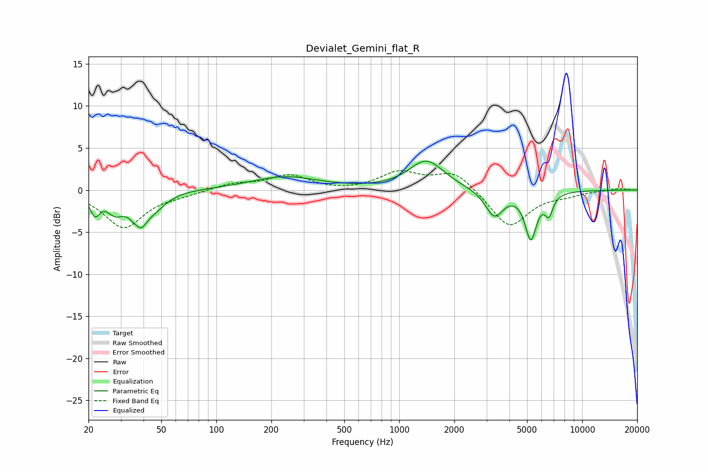

# Devialet_Gemini_flat_R
See [usage instructions](https://github.com/jaakkopasanen/AutoEq#usage) for more options and info.

### Parametric EQs
Apply preamp of -3.5 dB when using parametric equalizer.

|   # | Type    |   Fc (Hz) |    Q |   Gain (dB) |
|-----|---------|-----------|------|-------------|
|   1 | Peaking |        22 | 5.4  |        -2.3 |
|   2 | Peaking |        28 | 3.02 |        -2.1 |
|   3 | Peaking |        37 | 6    |         1.4 |
|   4 | Peaking |        38 | 3.78 |        -4.5 |
|   5 | Peaking |        46 | 2.14 |        -1.6 |
|   6 | Peaking |       237 | 0.76 |         1.6 |
|   7 | Peaking |      1408 | 1.48 |         3.5 |
|   8 | Peaking |      3311 | 2.86 |        -3.2 |
|   9 | Peaking |      5242 | 4.39 |        -5.5 |
|  10 | Peaking |      6583 | 6    |        -2.3 |

### Fixed Band EQs
When using fixed band (also called graphic) equalizer, apply preamp of **-2.4 dB** (if available) and set gains manually with these parameters.

|   # | Type    |   Fc (Hz) |    Q |   Gain (dB) |
|-----|---------|-----------|------|-------------|
|   1 | Peaking |        31 | 1.41 |        -4.4 |
|   2 | Peaking |        62 | 1.41 |        -0.4 |
|   3 | Peaking |       125 | 1.41 |         0.7 |
|   4 | Peaking |       250 | 1.41 |         1.7 |
|   5 | Peaking |       500 | 1.41 |        -0.2 |
|   6 | Peaking |      1000 | 1.41 |         2   |
|   7 | Peaking |      2000 | 1.41 |         2.3 |
|   8 | Peaking |      4000 | 1.41 |        -4.5 |
|   9 | Peaking |      8000 | 1.41 |        -0.5 |
|  10 | Peaking |     16000 | 1.41 |         0.2 |

### Graphs

