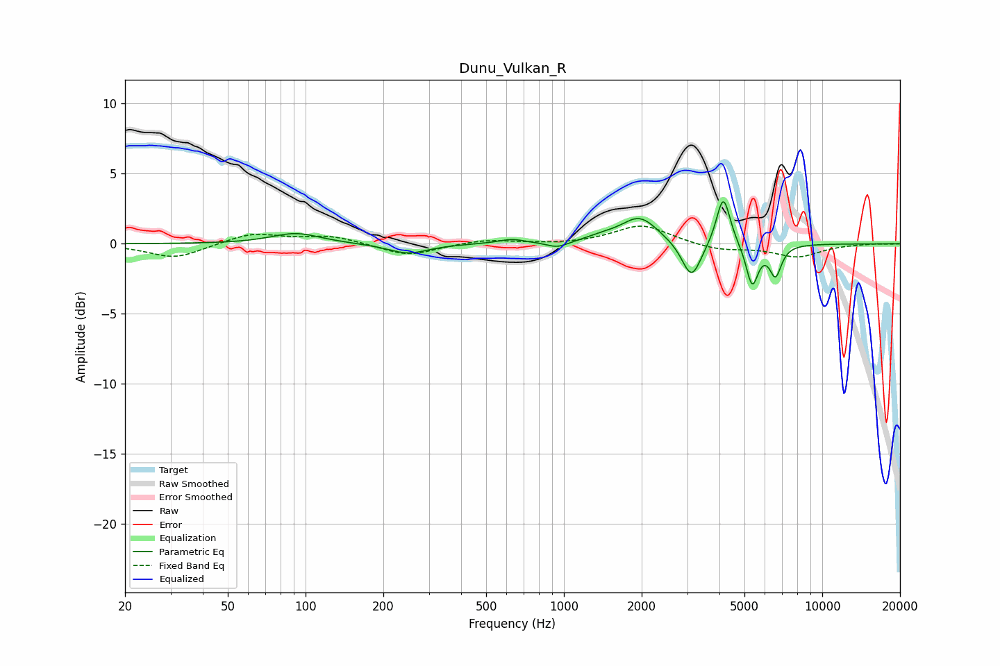

# Dunu_Vulkan_R
See [usage instructions](https://github.com/jaakkopasanen/AutoEq#usage) for more options and info.

### Parametric EQs
Apply preamp of -3.1 dB when using parametric equalizer.

|   # | Type    |   Fc (Hz) |    Q |   Gain (dB) |
|-----|---------|-----------|------|-------------|
|   1 | Peaking |        92 | 1.5  |         0.8 |
|   2 | Peaking |       249 | 1.81 |        -0.7 |
|   3 | Peaking |       627 | 2.68 |         0.3 |
|   4 | Peaking |       944 | 3.36 |        -0.4 |
|   5 | Peaking |      1412 | 2.22 |         0.3 |
|   6 | Peaking |      1965 | 2    |         1.9 |
|   7 | Peaking |      3120 | 3.8  |        -2.7 |
|   8 | Peaking |      4141 | 5.32 |         3.6 |
|   9 | Peaking |      5355 | 6    |        -3   |
|  10 | Peaking |      6593 | 6    |        -2.1 |

### Fixed Band EQs
When using fixed band (also called graphic) equalizer, apply preamp of **-1.4 dB** (if available) and set gains manually with these parameters.

|   # | Type    |   Fc (Hz) |    Q |   Gain (dB) |
|-----|---------|-----------|------|-------------|
|   1 | Peaking |        31 | 1.41 |        -1   |
|   2 | Peaking |        62 | 1.41 |         0.8 |
|   3 | Peaking |       125 | 1.41 |         0.5 |
|   4 | Peaking |       250 | 1.41 |        -0.9 |
|   5 | Peaking |       500 | 1.41 |         0.3 |
|   6 | Peaking |      1000 | 1.41 |        -0.1 |
|   7 | Peaking |      2000 | 1.41 |         1.4 |
|   8 | Peaking |      4000 | 1.41 |        -0.5 |
|   9 | Peaking |      8000 | 1.41 |        -0.9 |
|  10 | Peaking |     16000 | 1.41 |         0   |

### Graphs

