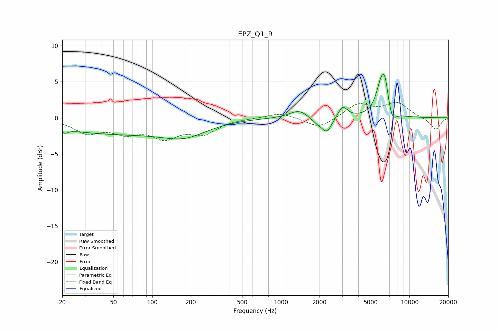

# EPZ_Q1_R
See [usage instructions](https://github.com/jaakkopasanen/AutoEq#usage) for more options and info.

### Parametric EQs
Apply preamp of -6.1 dB when using parametric equalizer.

|   # | Type    |   Fc (Hz) |    Q |   Gain (dB) |
|-----|---------|-----------|------|-------------|
|   1 | Peaking |        21 | 5.86 |        -0.5 |
|   2 | Peaking |        48 | 0.3  |        -2.1 |
|   3 | Peaking |       180 | 0.81 |        -1.8 |
|   4 | Peaking |      1390 | 1.93 |         1.2 |
|   5 | Peaking |      1912 | 2.67 |        -0.7 |
|   6 | Peaking |      2280 | 3.54 |        -2   |
|   7 | Peaking |      3024 | 3.87 |         1.6 |
|   8 | Peaking |      6080 | 3.32 |         4.9 |
|   9 | Peaking |      6485 | 5.91 |         2.2 |
|  10 | Peaking |      7341 | 4.35 |        -1.7 |

### Fixed Band EQs
When using fixed band (also called graphic) equalizer, apply preamp of **-2.3 dB** (if available) and set gains manually with these parameters.

|   # | Type    |   Fc (Hz) |    Q |   Gain (dB) |
|-----|---------|-----------|------|-------------|
|   1 | Peaking |        31 | 1.41 |        -1.9 |
|   2 | Peaking |        62 | 1.41 |        -1.7 |
|   3 | Peaking |       125 | 1.41 |        -2.5 |
|   4 | Peaking |       250 | 1.41 |        -1.9 |
|   5 | Peaking |       500 | 1.41 |        -0   |
|   6 | Peaking |      1000 | 1.41 |         0.8 |
|   7 | Peaking |      2000 | 1.41 |        -1.5 |
|   8 | Peaking |      4000 | 1.41 |         1.9 |
|   9 | Peaking |      8000 | 1.41 |         2   |
|  10 | Peaking |     16000 | 1.41 |        -1.7 |

### Graphs

