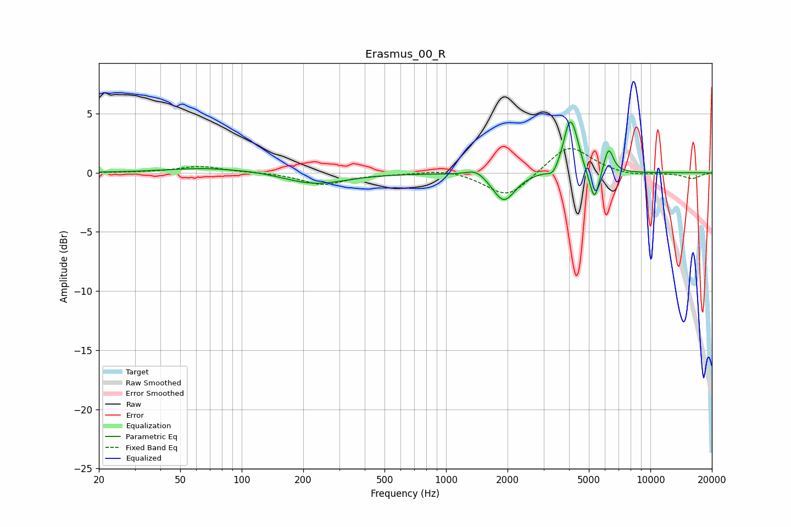

# Erasmus_00_R
See [usage instructions](https://github.com/jaakkopasanen/AutoEq#usage) for more options and info.

### Parametric EQs
Apply preamp of -4.4 dB when using parametric equalizer.

|   # | Type    |   Fc (Hz) |    Q |   Gain (dB) |
|-----|---------|-----------|------|-------------|
|   1 | Peaking |        67 | 0.76 |         0.4 |
|   2 | Peaking |       119 | 1.63 |         0.1 |
|   3 | Peaking |       229 | 0.94 |        -1   |
|   4 | Peaking |      1403 | 3.01 |         0.6 |
|   5 | Peaking |      1918 | 2.61 |        -2.4 |
|   6 | Peaking |      3325 | 5.96 |        -0.6 |
|   7 | Peaking |      4030 | 4.61 |         4.1 |
|   8 | Peaking |      4322 | 5.99 |         0.9 |
|   9 | Peaking |      5322 | 5.92 |        -2.8 |
|  10 | Peaking |      6242 | 6    |         2.2 |

### Fixed Band EQs
When using fixed band (also called graphic) equalizer, apply preamp of **-2.1 dB** (if available) and set gains manually with these parameters.

|   # | Type    |   Fc (Hz) |    Q |   Gain (dB) |
|-----|---------|-----------|------|-------------|
|   1 | Peaking |        31 | 1.41 |         0   |
|   2 | Peaking |        62 | 1.41 |         0.6 |
|   3 | Peaking |       125 | 1.41 |         0   |
|   4 | Peaking |       250 | 1.41 |        -1   |
|   5 | Peaking |       500 | 1.41 |        -0.1 |
|   6 | Peaking |      1000 | 1.41 |         0.3 |
|   7 | Peaking |      2000 | 1.41 |        -2.2 |
|   8 | Peaking |      4000 | 1.41 |         2.4 |
|   9 | Peaking |      8000 | 1.41 |        -0.3 |
|  10 | Peaking |     16000 | 1.41 |        -0.5 |

### Graphs

