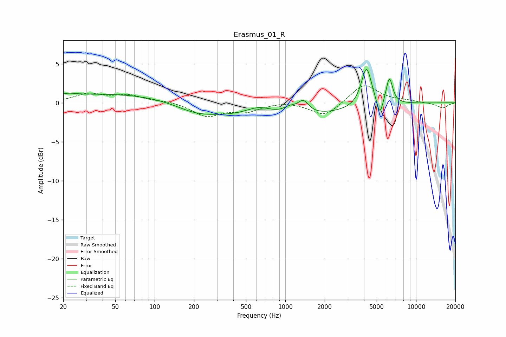

# Erasmus_01_R
See [usage instructions](https://github.com/jaakkopasanen/AutoEq#usage) for more options and info.

### Parametric EQs
Apply preamp of -4.4 dB when using parametric equalizer.

|   # | Type    |   Fc (Hz) |    Q |   Gain (dB) |
|-----|---------|-----------|------|-------------|
|   1 | Peaking |        21 | 1.94 |         0.4 |
|   2 | Peaking |        54 | 0.31 |         1.2 |
|   3 | Peaking |       205 | 0.96 |        -0.9 |
|   4 | Peaking |       629 | 1.34 |         1.3 |
|   5 | Peaking |       816 | 0.26 |        -2.1 |
|   6 | Peaking |      1084 | 2.65 |         0.8 |
|   7 | Peaking |      1374 | 3.35 |         1.6 |
|   8 | Peaking |      4176 | 3.59 |         5.1 |
|   9 | Peaking |      5283 | 5.99 |        -2.3 |
|  10 | Peaking |      6255 | 5.54 |         3.3 |

### Fixed Band EQs
When using fixed band (also called graphic) equalizer, apply preamp of **-2.3 dB** (if available) and set gains manually with these parameters.

|   # | Type    |   Fc (Hz) |    Q |   Gain (dB) |
|-----|---------|-----------|------|-------------|
|   1 | Peaking |        31 | 1.41 |         1.1 |
|   2 | Peaking |        62 | 1.41 |         0.9 |
|   3 | Peaking |       125 | 1.41 |         0.2 |
|   4 | Peaking |       250 | 1.41 |        -1.7 |
|   5 | Peaking |       500 | 1.41 |        -1   |
|   6 | Peaking |      1000 | 1.41 |         0.2 |
|   7 | Peaking |      2000 | 1.41 |        -1.8 |
|   8 | Peaking |      4000 | 1.41 |         2.5 |
|   9 | Peaking |      8000 | 1.41 |         0.2 |
|  10 | Peaking |     16000 | 1.41 |        -0.7 |

### Graphs

