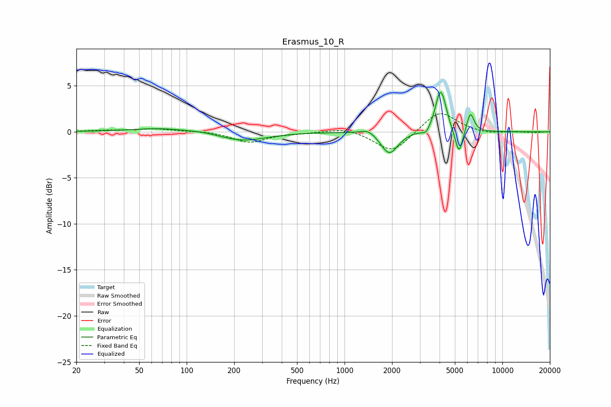

# Erasmus_10_R
See [usage instructions](https://github.com/jaakkopasanen/AutoEq#usage) for more options and info.

### Parametric EQs
Apply preamp of -4.4 dB when using parametric equalizer.

|   # | Type    |   Fc (Hz) |    Q |   Gain (dB) |
|-----|---------|-----------|------|-------------|
|   1 | Peaking |        68 | 0.81 |         0.4 |
|   2 | Peaking |       126 | 1.77 |         0.1 |
|   3 | Peaking |       227 | 0.94 |        -1   |
|   4 | Peaking |      1411 | 2.92 |         0.6 |
|   5 | Peaking |      1922 | 2.66 |        -2.4 |
|   6 | Peaking |      3278 | 5.92 |        -0.6 |
|   7 | Peaking |      4027 | 4.62 |         4.1 |
|   8 | Peaking |      4306 | 5.98 |         0.8 |
|   9 | Peaking |      5311 | 5.92 |        -2.8 |
|  10 | Peaking |      6269 | 6    |         2.2 |

### Fixed Band EQs
When using fixed band (also called graphic) equalizer, apply preamp of **-2.1 dB** (if available) and set gains manually with these parameters.

|   # | Type    |   Fc (Hz) |    Q |   Gain (dB) |
|-----|---------|-----------|------|-------------|
|   1 | Peaking |        31 | 1.41 |         0.1 |
|   2 | Peaking |        62 | 1.41 |         0.3 |
|   3 | Peaking |       125 | 1.41 |         0.1 |
|   4 | Peaking |       250 | 1.41 |        -1.1 |
|   5 | Peaking |       500 | 1.41 |        -0.1 |
|   6 | Peaking |      1000 | 1.41 |         0.5 |
|   7 | Peaking |      2000 | 1.41 |        -2.3 |
|   8 | Peaking |      4000 | 1.41 |         2.4 |
|   9 | Peaking |      8000 | 1.41 |        -0.3 |
|  10 | Peaking |     16000 | 1.41 |        -0.1 |

### Graphs

