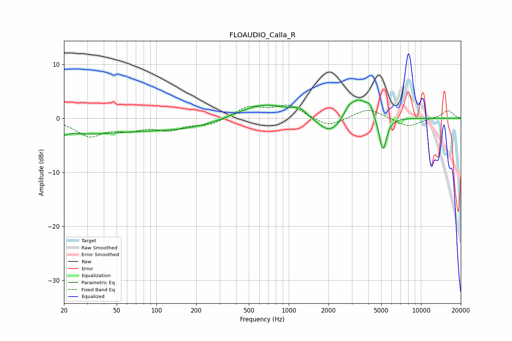

# FLOAUDIO_Calla_R
See [usage instructions](https://github.com/jaakkopasanen/AutoEq#usage) for more options and info.

### Parametric EQs
Apply preamp of -3.5 dB when using parametric equalizer.

|   # | Type    |   Fc (Hz) |    Q |   Gain (dB) |
|-----|---------|-----------|------|-------------|
|   1 | Peaking |        20 | 5.59 |        -0.6 |
|   2 | Peaking |        28 | 0.44 |        -2.6 |
|   3 | Peaking |       157 | 0.43 |        -1.9 |
|   4 | Peaking |       639 | 0.69 |         3   |
|   5 | Peaking |      1202 | 2.96 |         1.2 |
|   6 | Peaking |      2033 | 1.59 |        -3.2 |
|   7 | Peaking |      2833 | 4.27 |         1.4 |
|   8 | Peaking |      3376 | 2.23 |         3.5 |
|   9 | Peaking |      4086 | 4.99 |         1.8 |
|  10 | Peaking |      5154 | 4.92 |        -6.4 |

### Fixed Band EQs
When using fixed band (also called graphic) equalizer, apply preamp of **-2.5 dB** (if available) and set gains manually with these parameters.

|   # | Type    |   Fc (Hz) |    Q |   Gain (dB) |
|-----|---------|-----------|------|-------------|
|   1 | Peaking |        31 | 1.41 |        -3.1 |
|   2 | Peaking |        62 | 1.41 |        -1.7 |
|   3 | Peaking |       125 | 1.41 |        -1.8 |
|   4 | Peaking |       250 | 1.41 |        -1.2 |
|   5 | Peaking |       500 | 1.41 |         2.1 |
|   6 | Peaking |      1000 | 1.41 |         2.3 |
|   7 | Peaking |      2000 | 1.41 |        -1.7 |
|   8 | Peaking |      4000 | 1.41 |         1.9 |
|   9 | Peaking |      8000 | 1.41 |        -1.7 |
|  10 | Peaking |     16000 | 1.41 |         1.5 |

### Graphs

