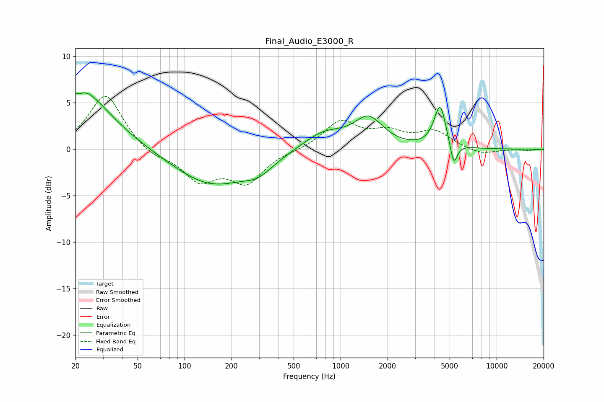

# Final_Audio_E3000_R
See [usage instructions](https://github.com/jaakkopasanen/AutoEq#usage) for more options and info.

### Parametric EQs
Apply preamp of -6.2 dB when using parametric equalizer.

|   # | Type    |   Fc (Hz) |    Q |   Gain (dB) |
|-----|---------|-----------|------|-------------|
|   1 | Peaking |        21 | 0.63 |         5.2 |
|   2 | Peaking |        21 | 5.94 |         2.1 |
|   3 | Peaking |        21 | 5.97 |        -2.6 |
|   4 | Peaking |        22 | 1.16 |         1.6 |
|   5 | Peaking |       149 | 0.58 |        -3.8 |
|   6 | Peaking |       297 | 1.51 |        -1.3 |
|   7 | Peaking |       781 | 1.02 |         1.9 |
|   8 | Peaking |      1514 | 1.54 |         3.1 |
|   9 | Peaking |      4340 | 3.73 |         4.6 |
|  10 | Peaking |      5310 | 6    |        -2.6 |

### Fixed Band EQs
When using fixed band (also called graphic) equalizer, apply preamp of **-5.8 dB** (if available) and set gains manually with these parameters.

|   # | Type    |   Fc (Hz) |    Q |   Gain (dB) |
|-----|---------|-----------|------|-------------|
|   1 | Peaking |        31 | 1.41 |         6   |
|   2 | Peaking |        62 | 1.41 |        -0.9 |
|   3 | Peaking |       125 | 1.41 |        -3.2 |
|   4 | Peaking |       250 | 1.41 |        -3.4 |
|   5 | Peaking |       500 | 1.41 |        -0.1 |
|   6 | Peaking |      1000 | 1.41 |         2.9 |
|   7 | Peaking |      2000 | 1.41 |         1.6 |
|   8 | Peaking |      4000 | 1.41 |         1.8 |
|   9 | Peaking |      8000 | 1.41 |        -0.6 |
|  10 | Peaking |     16000 | 1.41 |        -0.1 |

### Graphs

