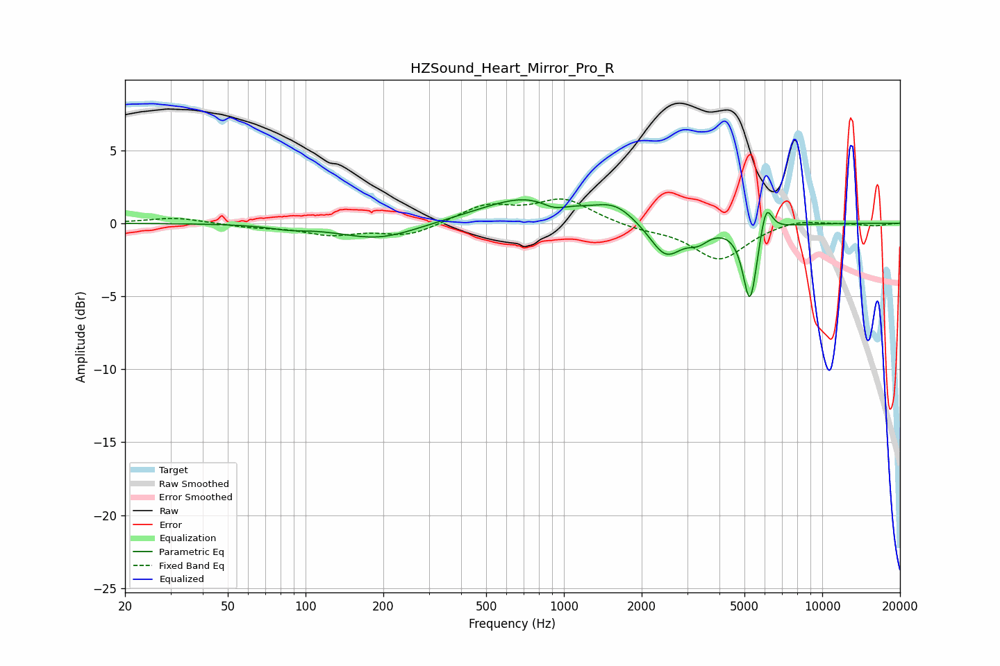

# HZSound_Heart_Mirror_Pro_R
See [usage instructions](https://github.com/jaakkopasanen/AutoEq#usage) for more options and info.

### Parametric EQs
Apply preamp of -1.7 dB when using parametric equalizer.

|   # | Type    |   Fc (Hz) |    Q |   Gain (dB) |
|-----|---------|-----------|------|-------------|
|   1 | Peaking |        86 | 1.93 |        -0.2 |
|   2 | Peaking |       192 | 0.94 |        -1.1 |
|   3 | Peaking |       718 | 0.75 |         1.7 |
|   4 | Peaking |       788 | 1.11 |         0.2 |
|   5 | Peaking |       916 | 2.84 |        -0.6 |
|   6 | Peaking |      1579 | 1.83 |         1   |
|   7 | Peaking |      2478 | 2.23 |        -2.4 |
|   8 | Peaking |      3312 | 3.37 |        -0.8 |
|   9 | Peaking |      5254 | 5.08 |        -5.4 |
|  10 | Peaking |      6057 | 6    |         2.2 |

### Fixed Band EQs
When using fixed band (also called graphic) equalizer, apply preamp of **-1.8 dB** (if available) and set gains manually with these parameters.

|   # | Type    |   Fc (Hz) |    Q |   Gain (dB) |
|-----|---------|-----------|------|-------------|
|   1 | Peaking |        31 | 1.41 |         0.4 |
|   2 | Peaking |        62 | 1.41 |        -0.2 |
|   3 | Peaking |       125 | 1.41 |        -0.7 |
|   4 | Peaking |       250 | 1.41 |        -0.9 |
|   5 | Peaking |       500 | 1.41 |         1.2 |
|   6 | Peaking |      1000 | 1.41 |         1.6 |
|   7 | Peaking |      2000 | 1.41 |        -0.4 |
|   8 | Peaking |      4000 | 1.41 |        -2.5 |
|   9 | Peaking |      8000 | 1.41 |         0.4 |
|  10 | Peaking |     16000 | 1.41 |        -0.2 |

### Graphs

