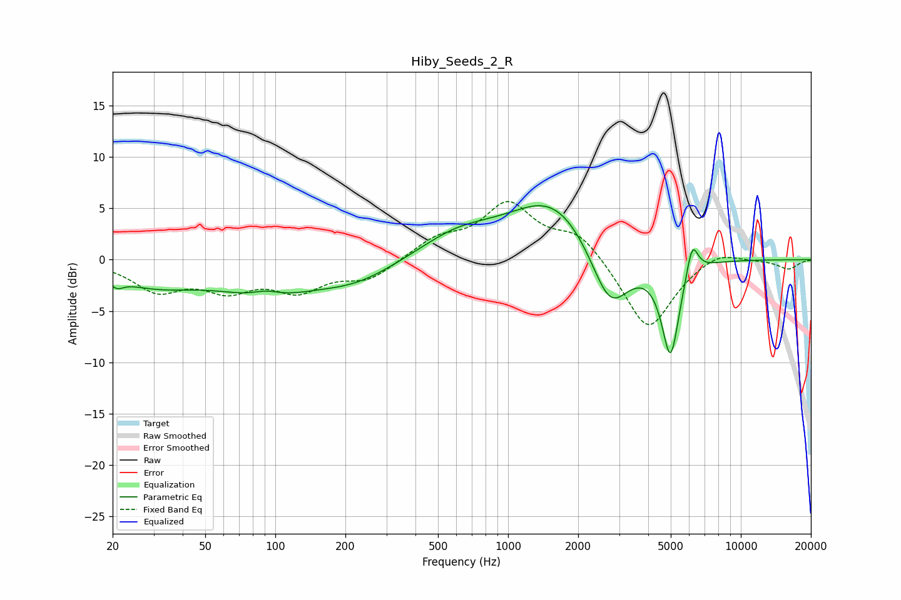

# Hiby_Seeds_2_R
See [usage instructions](https://github.com/jaakkopasanen/AutoEq#usage) for more options and info.

### Parametric EQs
Apply preamp of -5.3 dB when using parametric equalizer.

|   # | Type    |   Fc (Hz) |    Q |   Gain (dB) |
|-----|---------|-----------|------|-------------|
|   1 | Peaking |        21 | 5.22 |        -0.8 |
|   2 | Peaking |        30 | 0.69 |        -2.3 |
|   3 | Peaking |        91 | 2.11 |         0.9 |
|   4 | Peaking |        92 | 0.77 |        -2.9 |
|   5 | Peaking |       220 | 0.78 |        -2   |
|   6 | Peaking |       606 | 0.84 |         2.2 |
|   7 | Peaking |      1580 | 0.74 |         6.1 |
|   8 | Peaking |      2738 | 1.61 |        -6.7 |
|   9 | Peaking |      4987 | 3.58 |        -9.4 |
|  10 | Peaking |      6180 | 5.47 |         3.3 |

### Fixed Band EQs
When using fixed band (also called graphic) equalizer, apply preamp of **-5.8 dB** (if available) and set gains manually with these parameters.

|   # | Type    |   Fc (Hz) |    Q |   Gain (dB) |
|-----|---------|-----------|------|-------------|
|   1 | Peaking |        31 | 1.41 |        -2.8 |
|   2 | Peaking |        62 | 1.41 |        -2.5 |
|   3 | Peaking |       125 | 1.41 |        -2.7 |
|   4 | Peaking |       250 | 1.41 |        -1.8 |
|   5 | Peaking |       500 | 1.41 |         1.8 |
|   6 | Peaking |      1000 | 1.41 |         5.2 |
|   7 | Peaking |      2000 | 1.41 |         2.6 |
|   8 | Peaking |      4000 | 1.41 |        -7.1 |
|   9 | Peaking |      8000 | 1.41 |         1.1 |
|  10 | Peaking |     16000 | 1.41 |        -0.9 |

### Graphs

