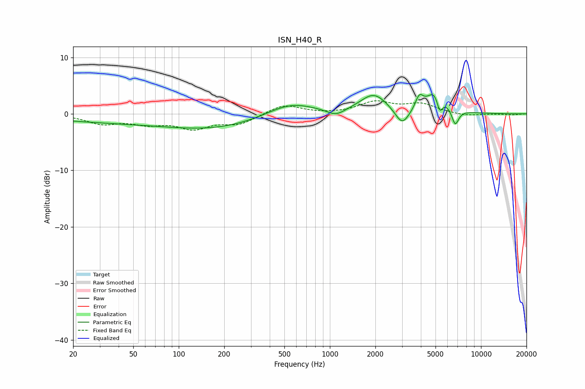

# ISN_H40_R
See [usage instructions](https://github.com/jaakkopasanen/AutoEq#usage) for more options and info.

### Parametric EQs
Apply preamp of -3.5 dB when using parametric equalizer.

|   # | Type    |   Fc (Hz) |    Q |   Gain (dB) |
|-----|---------|-----------|------|-------------|
|   1 | Peaking |        68 | 0.18 |        -1.6 |
|   2 | Peaking |       180 | 0.46 |        -1.3 |
|   3 | Peaking |       545 | 0.87 |         2.4 |
|   4 | Peaking |      1095 | 2.39 |        -1.2 |
|   5 | Peaking |      1955 | 1.57 |         3.4 |
|   6 | Peaking |      3011 | 2.99 |        -3.1 |
|   7 | Peaking |      3906 | 5.49 |         2.3 |
|   8 | Peaking |      5099 | 2.47 |         5   |
|   9 | Peaking |      5326 | 6    |        -4   |
|  10 | Peaking |      6750 | 5.84 |        -2.9 |

### Fixed Band EQs
When using fixed band (also called graphic) equalizer, apply preamp of **-2.4 dB** (if available) and set gains manually with these parameters.

|   # | Type    |   Fc (Hz) |    Q |   Gain (dB) |
|-----|---------|-----------|------|-------------|
|   1 | Peaking |        31 | 1.41 |        -1.6 |
|   2 | Peaking |        62 | 1.41 |        -1.4 |
|   3 | Peaking |       125 | 1.41 |        -2.3 |
|   4 | Peaking |       250 | 1.41 |        -1.7 |
|   5 | Peaking |       500 | 1.41 |         1.7 |
|   6 | Peaking |      1000 | 1.41 |        -0.1 |
|   7 | Peaking |      2000 | 1.41 |         2   |
|   8 | Peaking |      4000 | 1.41 |         1.6 |
|   9 | Peaking |      8000 | 1.41 |        -0.4 |
|  10 | Peaking |     16000 | 1.41 |        -0.2 |

### Graphs

