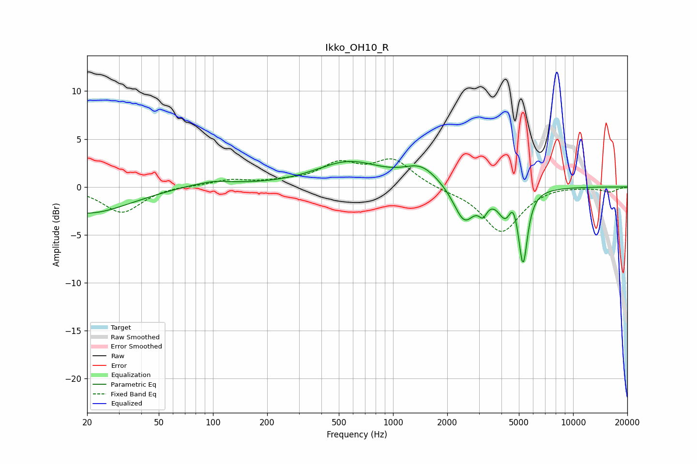

# Ikko_OH10_R
See [usage instructions](https://github.com/jaakkopasanen/AutoEq#usage) for more options and info.

### Parametric EQs
Apply preamp of -2.7 dB when using parametric equalizer.

|   # | Type    |   Fc (Hz) |    Q |   Gain (dB) |
|-----|---------|-----------|------|-------------|
|   1 | Peaking |        20 | 0.61 |        -2.8 |
|   2 | Peaking |        94 | 0.86 |         0.6 |
|   3 | Peaking |       101 | 3.18 |         0.1 |
|   4 | Peaking |       568 | 0.77 |         2.5 |
|   5 | Peaking |      1437 | 1.47 |         1.9 |
|   6 | Peaking |      2487 | 2.41 |        -3.7 |
|   7 | Peaking |      3157 | 5.96 |        -1.4 |
|   8 | Peaking |      4207 | 3.43 |        -2.6 |
|   9 | Peaking |      4635 | 6    |         1.4 |
|  10 | Peaking |      5274 | 5.68 |        -7.5 |

### Fixed Band EQs
When using fixed band (also called graphic) equalizer, apply preamp of **-3.0 dB** (if available) and set gains manually with these parameters.

|   # | Type    |   Fc (Hz) |    Q |   Gain (dB) |
|-----|---------|-----------|------|-------------|
|   1 | Peaking |        31 | 1.41 |        -2.7 |
|   2 | Peaking |        62 | 1.41 |         0.1 |
|   3 | Peaking |       125 | 1.41 |         0.7 |
|   4 | Peaking |       250 | 1.41 |         0.4 |
|   5 | Peaking |       500 | 1.41 |         2.2 |
|   6 | Peaking |      1000 | 1.41 |         2.7 |
|   7 | Peaking |      2000 | 1.41 |        -0.3 |
|   8 | Peaking |      4000 | 1.41 |        -4.7 |
|   9 | Peaking |      8000 | 1.41 |         0.2 |
|  10 | Peaking |     16000 | 1.41 |        -0.5 |

### Graphs

