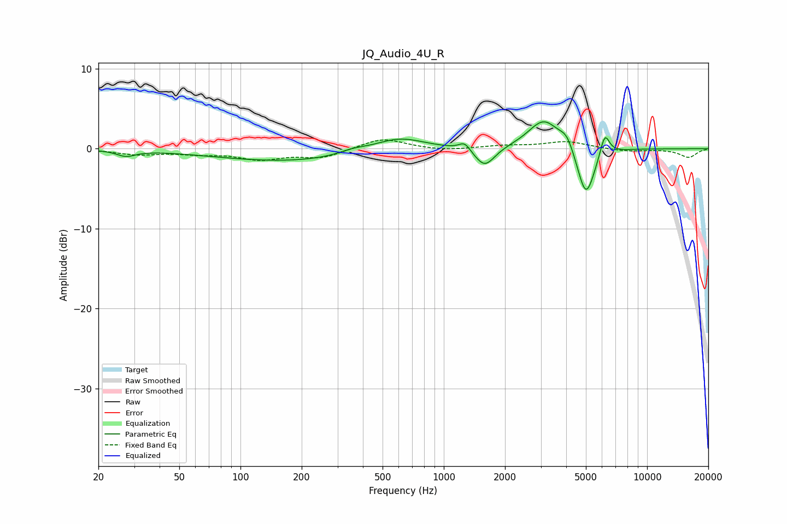

# JQ_Audio_4U_R
See [usage instructions](https://github.com/jaakkopasanen/AutoEq#usage) for more options and info.

### Parametric EQs
Apply preamp of -3.5 dB when using parametric equalizer.

|   # | Type    |   Fc (Hz) |    Q |   Gain (dB) |
|-----|---------|-----------|------|-------------|
|   1 | Peaking |        27 | 3.17 |        -0.7 |
|   2 | Peaking |       176 | 0.38 |        -1.6 |
|   3 | Peaking |       357 | 2.02 |         0.5 |
|   4 | Peaking |       601 | 1.11 |         1.8 |
|   5 | Peaking |      1266 | 5.17 |         1   |
|   6 | Peaking |      1590 | 2.87 |        -2.5 |
|   7 | Peaking |      3108 | 1.84 |         3.7 |
|   8 | Peaking |      4034 | 4.03 |         1.6 |
|   9 | Peaking |      5004 | 3.2  |        -6.5 |
|  10 | Peaking |      6195 | 5.98 |         2.9 |

### Fixed Band EQs
When using fixed band (also called graphic) equalizer, apply preamp of **-1.2 dB** (if available) and set gains manually with these parameters.

|   # | Type    |   Fc (Hz) |    Q |   Gain (dB) |
|-----|---------|-----------|------|-------------|
|   1 | Peaking |        31 | 1.41 |        -0.7 |
|   2 | Peaking |        62 | 1.41 |        -0.5 |
|   3 | Peaking |       125 | 1.41 |        -1.2 |
|   4 | Peaking |       250 | 1.41 |        -1.1 |
|   5 | Peaking |       500 | 1.41 |         1.4 |
|   6 | Peaking |      1000 | 1.41 |        -0.3 |
|   7 | Peaking |      2000 | 1.41 |         0.3 |
|   8 | Peaking |      4000 | 1.41 |         0.9 |
|   9 | Peaking |      8000 | 1.41 |        -0.3 |
|  10 | Peaking |     16000 | 1.41 |        -1.1 |

### Graphs

