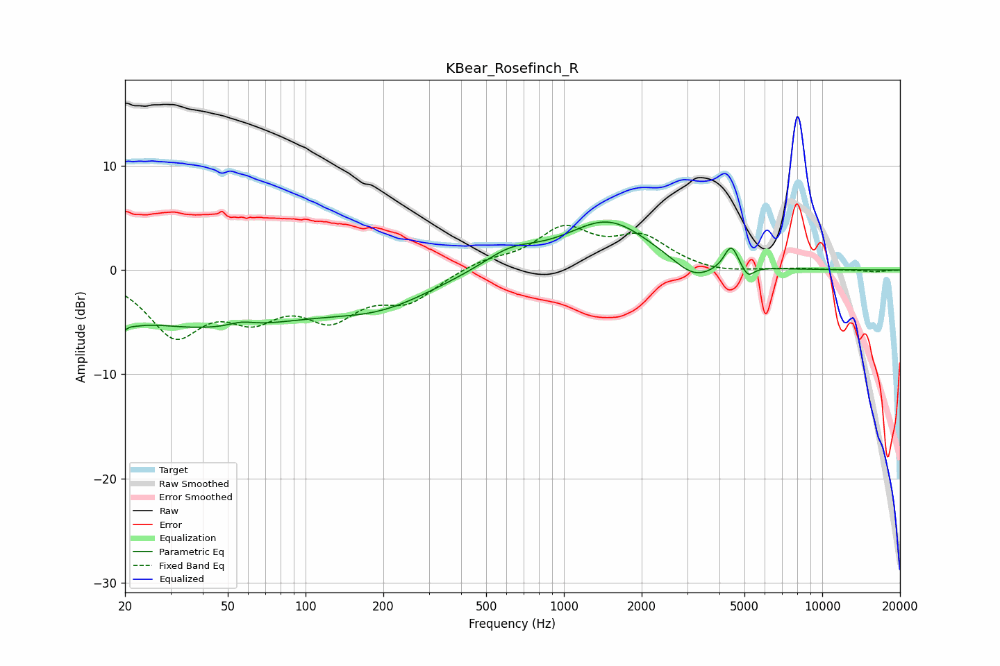

# KBear_Rosefinch_R
See [usage instructions](https://github.com/jaakkopasanen/AutoEq#usage) for more options and info.

### Parametric EQs
Apply preamp of -4.7 dB when using parametric equalizer.

|   # | Type    |   Fc (Hz) |    Q |   Gain (dB) |
|-----|---------|-----------|------|-------------|
|   1 | Peaking |        20 | 4.31 |        -5.2 |
|   2 | Peaking |        20 | 5.02 |         3.8 |
|   3 | Peaking |        40 | 0.32 |        -5.3 |
|   4 | Peaking |        56 | 2.99 |         0.5 |
|   5 | Peaking |       199 | 0.69 |        -2.5 |
|   6 | Peaking |       619 | 1.32 |         1.7 |
|   7 | Peaking |      1479 | 0.86 |         4.7 |
|   8 | Peaking |      3191 | 1.75 |        -1.8 |
|   9 | Peaking |      4443 | 5.22 |         2.3 |
|  10 | Peaking |      5154 | 6    |        -1.1 |

### Fixed Band EQs
When using fixed band (also called graphic) equalizer, apply preamp of **-4.4 dB** (if available) and set gains manually with these parameters.

|   # | Type    |   Fc (Hz) |    Q |   Gain (dB) |
|-----|---------|-----------|------|-------------|
|   1 | Peaking |        31 | 1.41 |        -5.8 |
|   2 | Peaking |        62 | 1.41 |        -3.6 |
|   3 | Peaking |       125 | 1.41 |        -4   |
|   4 | Peaking |       250 | 1.41 |        -2.7 |
|   5 | Peaking |       500 | 1.41 |         0.9 |
|   6 | Peaking |      1000 | 1.41 |         3.7 |
|   7 | Peaking |      2000 | 1.41 |         2.9 |
|   8 | Peaking |      4000 | 1.41 |        -0.4 |
|   9 | Peaking |      8000 | 1.41 |         0.1 |
|  10 | Peaking |     16000 | 1.41 |        -0.2 |

### Graphs

