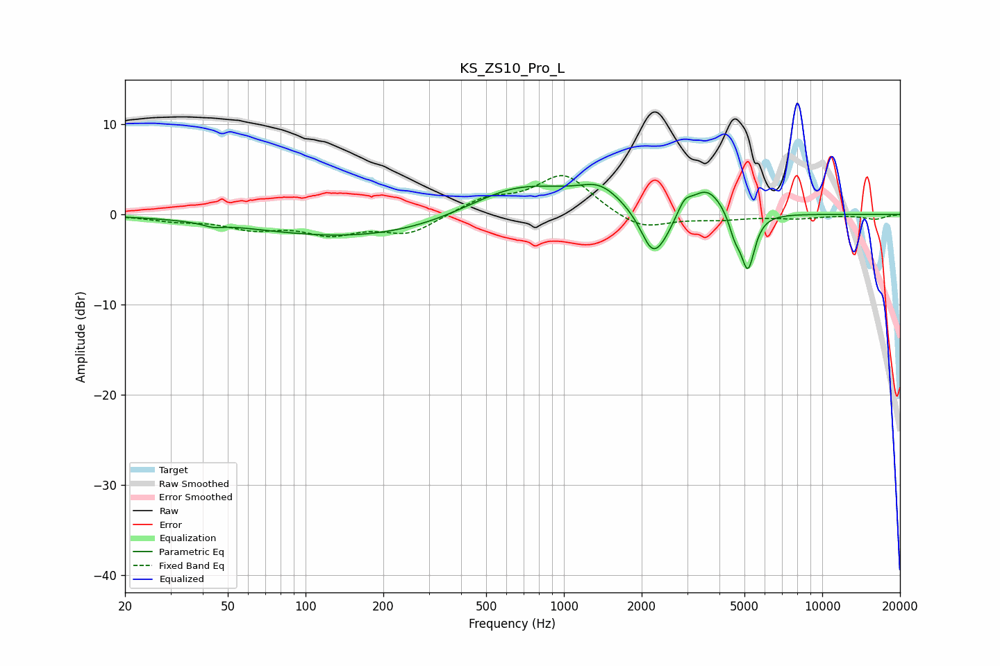

# KS_ZS10_Pro_L
See [usage instructions](https://github.com/jaakkopasanen/AutoEq#usage) for more options and info.

### Parametric EQs
Apply preamp of -3.4 dB when using parametric equalizer.

|   # | Type    |   Fc (Hz) |    Q |   Gain (dB) |
|-----|---------|-----------|------|-------------|
|   1 | Peaking |        44 | 3.86 |        -0.4 |
|   2 | Peaking |       223 | 0.27 |        -3   |
|   3 | Peaking |       659 | 0.62 |         4.7 |
|   4 | Peaking |      1380 | 1.71 |         2.1 |
|   5 | Peaking |      2199 | 2.98 |        -4.5 |
|   6 | Peaking |      2460 | 2.97 |        -1.4 |
|   7 | Peaking |      2924 | 5.55 |         1.3 |
|   8 | Peaking |      3576 | 2.12 |         3.1 |
|   9 | Peaking |      4587 | 6    |        -2.1 |
|  10 | Peaking |      5155 | 5.23 |        -6.2 |

### Fixed Band EQs
When using fixed band (also called graphic) equalizer, apply preamp of **-4.4 dB** (if available) and set gains manually with these parameters.

|   # | Type    |   Fc (Hz) |    Q |   Gain (dB) |
|-----|---------|-----------|------|-------------|
|   1 | Peaking |        31 | 1.41 |        -0.6 |
|   2 | Peaking |        62 | 1.41 |        -1.4 |
|   3 | Peaking |       125 | 1.41 |        -1.9 |
|   4 | Peaking |       250 | 1.41 |        -2.1 |
|   5 | Peaking |       500 | 1.41 |         1.7 |
|   6 | Peaking |      1000 | 1.41 |         4.4 |
|   7 | Peaking |      2000 | 1.41 |        -1.8 |
|   8 | Peaking |      4000 | 1.41 |        -0.5 |
|   9 | Peaking |      8000 | 1.41 |        -0.4 |
|  10 | Peaking |     16000 | 1.41 |        -0.5 |

### Graphs

