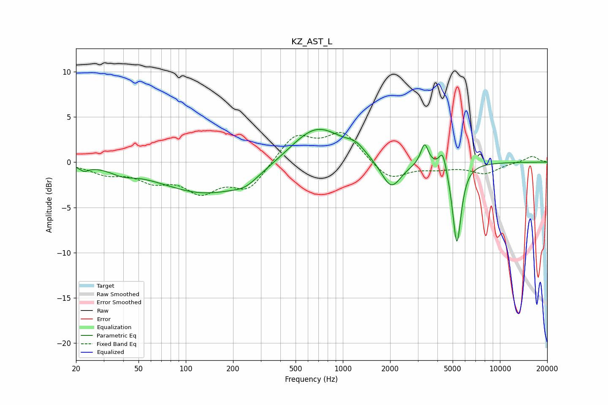

# KZ_AST_L
See [usage instructions](https://github.com/jaakkopasanen/AutoEq#usage) for more options and info.

### Parametric EQs
Apply preamp of -3.7 dB when using parametric equalizer.

|   # | Type    |   Fc (Hz) |    Q |   Gain (dB) |
|-----|---------|-----------|------|-------------|
|   1 | Peaking |        23 | 5.1  |        -0.5 |
|   2 | Peaking |        40 | 2.04 |        -0.6 |
|   3 | Peaking |       137 | 0.48 |        -3.5 |
|   4 | Peaking |       240 | 1.82 |        -0.8 |
|   5 | Peaking |       680 | 0.85 |         4.2 |
|   6 | Peaking |      1207 | 2.53 |         0.9 |
|   7 | Peaking |      2031 | 2.21 |        -3.2 |
|   8 | Peaking |      3313 | 5.81 |         2.4 |
|   9 | Peaking |      4328 | 6    |         2.1 |
|  10 | Peaking |      5321 | 5.06 |        -9.1 |

### Fixed Band EQs
When using fixed band (also called graphic) equalizer, apply preamp of **-3.4 dB** (if available) and set gains manually with these parameters.

|   # | Type    |   Fc (Hz) |    Q |   Gain (dB) |
|-----|---------|-----------|------|-------------|
|   1 | Peaking |        31 | 1.41 |        -1.1 |
|   2 | Peaking |        62 | 1.41 |        -1.7 |
|   3 | Peaking |       125 | 1.41 |        -2.9 |
|   4 | Peaking |       250 | 1.41 |        -2.9 |
|   5 | Peaking |       500 | 1.41 |         3   |
|   6 | Peaking |      1000 | 1.41 |         3.2 |
|   7 | Peaking |      2000 | 1.41 |        -2   |
|   8 | Peaking |      4000 | 1.41 |        -0.6 |
|   9 | Peaking |      8000 | 1.41 |        -1.2 |
|  10 | Peaking |     16000 | 1.41 |         0.7 |

### Graphs

