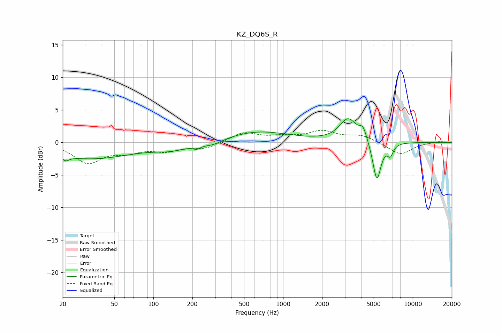

# KZ_DQ6S_R
See [usage instructions](https://github.com/jaakkopasanen/AutoEq#usage) for more options and info.

### Parametric EQs
Apply preamp of -3.7 dB when using parametric equalizer.

|   # | Type    |   Fc (Hz) |    Q |   Gain (dB) |
|-----|---------|-----------|------|-------------|
|   1 | Peaking |        21 | 5.83 |        -0.7 |
|   2 | Peaking |        33 | 0.43 |        -2.5 |
|   3 | Peaking |       139 | 1.12 |        -0.9 |
|   4 | Peaking |       215 | 5.15 |        -0.5 |
|   5 | Peaking |       286 | 1.86 |        -0.7 |
|   6 | Peaking |       643 | 0.58 |         1.7 |
|   7 | Peaking |      3177 | 2.14 |         3.5 |
|   8 | Peaking |      4140 | 4.85 |         1.8 |
|   9 | Peaking |      5287 | 4.35 |        -6.1 |
|  10 | Peaking |      6719 | 6    |        -1.6 |

### Fixed Band EQs
When using fixed band (also called graphic) equalizer, apply preamp of **-2.0 dB** (if available) and set gains manually with these parameters.

|   # | Type    |   Fc (Hz) |    Q |   Gain (dB) |
|-----|---------|-----------|------|-------------|
|   1 | Peaking |        31 | 1.41 |        -3   |
|   2 | Peaking |        62 | 1.41 |        -1.2 |
|   3 | Peaking |       125 | 1.41 |        -1.1 |
|   4 | Peaking |       250 | 1.41 |        -0.9 |
|   5 | Peaking |       500 | 1.41 |         1.5 |
|   6 | Peaking |      1000 | 1.41 |         0.7 |
|   7 | Peaking |      2000 | 1.41 |         1.6 |
|   8 | Peaking |      4000 | 1.41 |         1   |
|   9 | Peaking |      8000 | 1.41 |        -1.9 |
|  10 | Peaking |     16000 | 1.41 |         0.2 |

### Graphs

