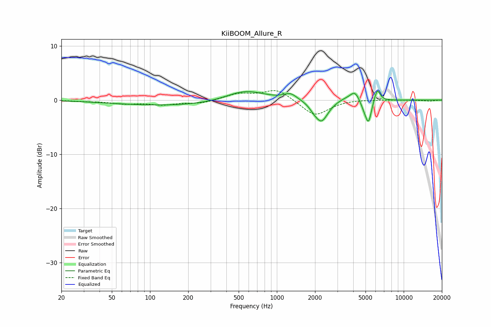

# KiiBOOM_Allure_R
See [usage instructions](https://github.com/jaakkopasanen/AutoEq#usage) for more options and info.

### Parametric EQs
Apply preamp of -1.8 dB when using parametric equalizer.

|   # | Type    |   Fc (Hz) |    Q |   Gain (dB) |
|-----|---------|-----------|------|-------------|
|   1 | Peaking |       168 | 0.27 |        -1.1 |
|   2 | Peaking |       560 | 0.9  |         2.2 |
|   3 | Peaking |      1277 | 2.72 |         1.2 |
|   4 | Peaking |      1939 | 4.55 |        -0.5 |
|   5 | Peaking |      2243 | 2.71 |        -4   |
|   6 | Peaking |      3404 | 2.36 |         0.4 |
|   7 | Peaking |      4123 | 3.72 |         1.8 |
|   8 | Peaking |      4878 | 4.36 |        -1.3 |
|   9 | Peaking |      5279 | 5.96 |        -3.8 |
|  10 | Peaking |      6185 | 6    |         2.4 |

### Fixed Band EQs
When using fixed band (also called graphic) equalizer, apply preamp of **-1.8 dB** (if available) and set gains manually with these parameters.

|   # | Type    |   Fc (Hz) |    Q |   Gain (dB) |
|-----|---------|-----------|------|-------------|
|   1 | Peaking |        31 | 1.41 |        -0.2 |
|   2 | Peaking |        62 | 1.41 |        -0.6 |
|   3 | Peaking |       125 | 1.41 |        -0.8 |
|   4 | Peaking |       250 | 1.41 |        -0.6 |
|   5 | Peaking |       500 | 1.41 |         1.1 |
|   6 | Peaking |      1000 | 1.41 |         2   |
|   7 | Peaking |      2000 | 1.41 |        -3   |
|   8 | Peaking |      4000 | 1.41 |         0.1 |
|   9 | Peaking |      8000 | 1.41 |         0   |
|  10 | Peaking |     16000 | 1.41 |        -0.2 |

### Graphs

