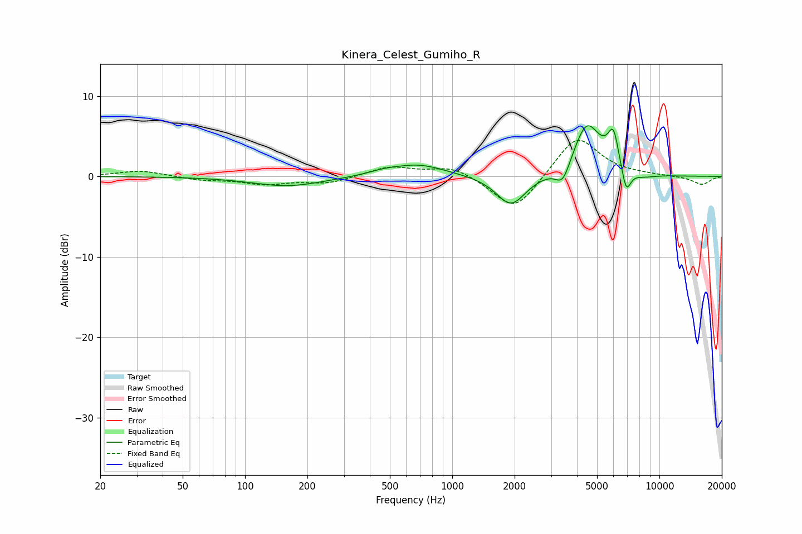

# Kinera_Celest_Gumiho_R
See [usage instructions](https://github.com/jaakkopasanen/AutoEq#usage) for more options and info.

### Parametric EQs
Apply preamp of -6.4 dB when using parametric equalizer.

|   # | Type    |   Fc (Hz) |    Q |   Gain (dB) |
|-----|---------|-----------|------|-------------|
|   1 | Peaking |       161 | 0.83 |        -1.2 |
|   2 | Peaking |       464 | 1.82 |         0.4 |
|   3 | Peaking |       687 | 1.09 |         1.5 |
|   4 | Peaking |      1922 | 2    |        -3.8 |
|   5 | Peaking |      3417 | 4.05 |        -2.5 |
|   6 | Peaking |      4460 | 2.13 |         6.5 |
|   7 | Peaking |      5906 | 3.1  |         1.4 |
|   8 | Peaking |      6001 | 5.91 |         3.2 |
|   9 | Peaking |      6910 | 6    |        -3.3 |
|  10 | Peaking |      8248 | 2.09 |        -0.5 |

### Fixed Band EQs
When using fixed band (also called graphic) equalizer, apply preamp of **-4.6 dB** (if available) and set gains manually with these parameters.

|   # | Type    |   Fc (Hz) |    Q |   Gain (dB) |
|-----|---------|-----------|------|-------------|
|   1 | Peaking |        31 | 1.41 |         0.7 |
|   2 | Peaking |        62 | 1.41 |        -0.4 |
|   3 | Peaking |       125 | 1.41 |        -0.9 |
|   4 | Peaking |       250 | 1.41 |        -0.8 |
|   5 | Peaking |       500 | 1.41 |         1.2 |
|   6 | Peaking |      1000 | 1.41 |         1.3 |
|   7 | Peaking |      2000 | 1.41 |        -4.5 |
|   8 | Peaking |      4000 | 1.41 |         5.2 |
|   9 | Peaking |      8000 | 1.41 |         0.1 |
|  10 | Peaking |     16000 | 1.41 |        -1   |

### Graphs

