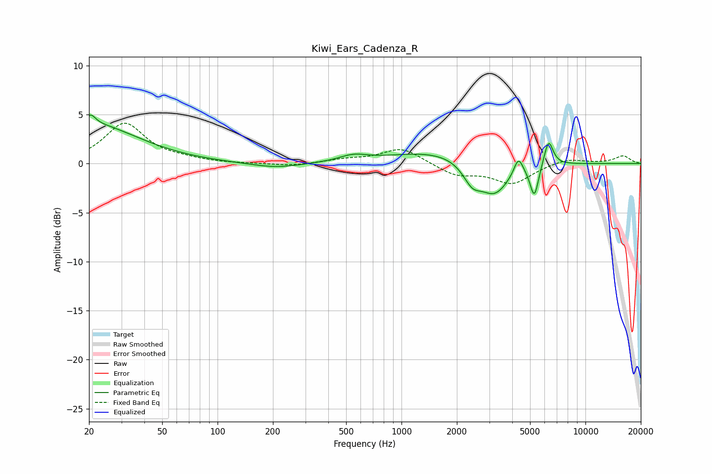

# Kiwi_Ears_Cadenza_R
See [usage instructions](https://github.com/jaakkopasanen/AutoEq#usage) for more options and info.

### Parametric EQs
Apply preamp of -5.0 dB when using parametric equalizer.

|   # | Type    |   Fc (Hz) |    Q |   Gain (dB) |
|-----|---------|-----------|------|-------------|
|   1 | Peaking |        20 | 0.55 |         4   |
|   2 | Peaking |        20 | 5.66 |         0.9 |
|   3 | Peaking |       208 | 1.03 |        -0.5 |
|   4 | Peaking |       547 | 1.87 |         0.6 |
|   5 | Peaking |      1591 | 0.56 |         1.3 |
|   6 | Peaking |      2423 | 2.82 |        -1.9 |
|   7 | Peaking |      3203 | 1.73 |        -3.4 |
|   8 | Peaking |      4322 | 5.82 |         1.8 |
|   9 | Peaking |      5275 | 5.97 |        -3.3 |
|  10 | Peaking |      6304 | 5.56 |         2.7 |

### Fixed Band EQs
When using fixed band (also called graphic) equalizer, apply preamp of **-4.2 dB** (if available) and set gains manually with these parameters.

|   # | Type    |   Fc (Hz) |    Q |   Gain (dB) |
|-----|---------|-----------|------|-------------|
|   1 | Peaking |        31 | 1.41 |         4.1 |
|   2 | Peaking |        62 | 1.41 |         0.3 |
|   3 | Peaking |       125 | 1.41 |        -0   |
|   4 | Peaking |       250 | 1.41 |        -0.3 |
|   5 | Peaking |       500 | 1.41 |         0.4 |
|   6 | Peaking |      1000 | 1.41 |         1.6 |
|   7 | Peaking |      2000 | 1.41 |        -1.2 |
|   8 | Peaking |      4000 | 1.41 |        -2   |
|   9 | Peaking |      8000 | 1.41 |         0.6 |
|  10 | Peaking |     16000 | 1.41 |         0.8 |

### Graphs

