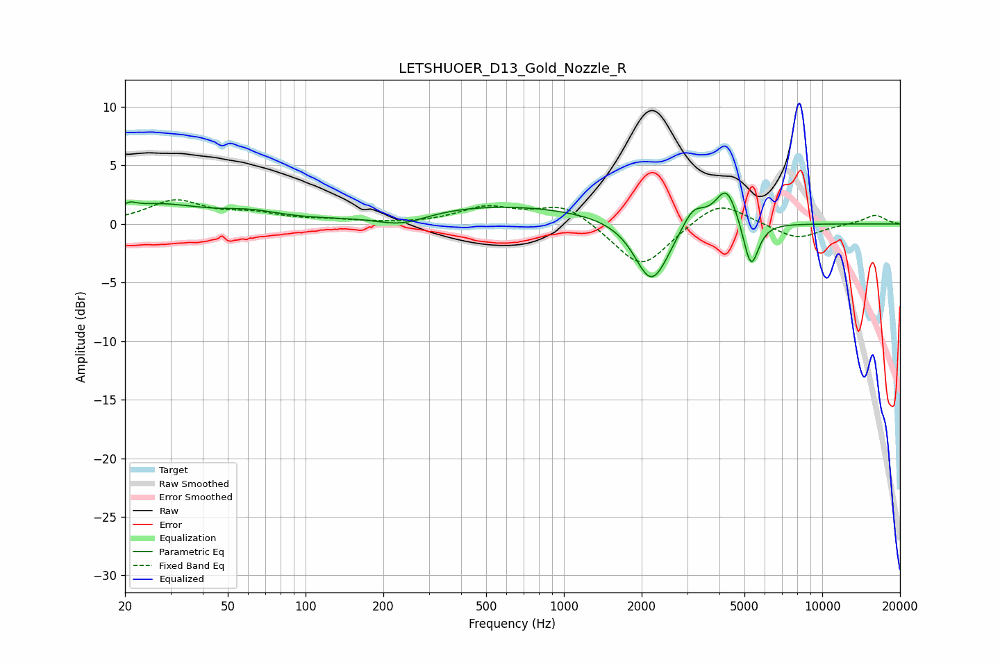

# LETSHUOER_D13_Gold_Nozzle_R
See [usage instructions](https://github.com/jaakkopasanen/AutoEq#usage) for more options and info.

### Parametric EQs
Apply preamp of -2.7 dB when using parametric equalizer.

|   # | Type    |   Fc (Hz) |    Q |   Gain (dB) |
|-----|---------|-----------|------|-------------|
|   1 | Peaking |        21 | 5.81 |         0.5 |
|   2 | Peaking |        26 | 0.84 |         1.6 |
|   3 | Peaking |        61 | 1.18 |         0.7 |
|   4 | Peaking |       236 | 1.41 |        -1   |
|   5 | Peaking |       559 | 0.36 |         1.6 |
|   6 | Peaking |      2160 | 2.24 |        -4.5 |
|   7 | Peaking |      2357 | 2.27 |        -1   |
|   8 | Peaking |      3167 | 3.26 |         1.7 |
|   9 | Peaking |      4262 | 3.25 |         3.3 |
|  10 | Peaking |      5295 | 4.7  |        -4.2 |

### Fixed Band EQs
When using fixed band (also called graphic) equalizer, apply preamp of **-2.2 dB** (if available) and set gains manually with these parameters.

|   # | Type    |   Fc (Hz) |    Q |   Gain (dB) |
|-----|---------|-----------|------|-------------|
|   1 | Peaking |        31 | 1.41 |         1.9 |
|   2 | Peaking |        62 | 1.41 |         0.7 |
|   3 | Peaking |       125 | 1.41 |         0.2 |
|   4 | Peaking |       250 | 1.41 |        -0   |
|   5 | Peaking |       500 | 1.41 |         1.4 |
|   6 | Peaking |      1000 | 1.41 |         1.7 |
|   7 | Peaking |      2000 | 1.41 |        -3.9 |
|   8 | Peaking |      4000 | 1.41 |         2.1 |
|   9 | Peaking |      8000 | 1.41 |        -1.3 |
|  10 | Peaking |     16000 | 1.41 |         0.8 |

### Graphs

